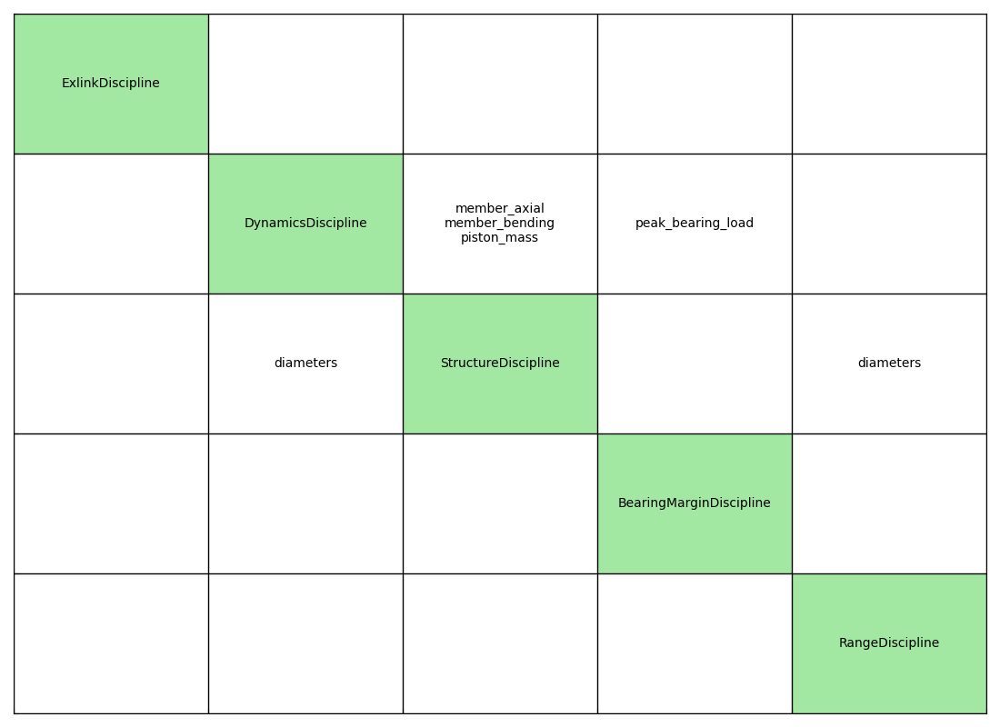
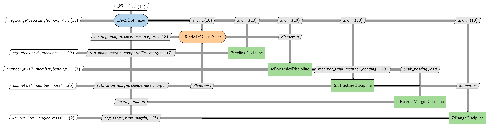

# EX-link Atkinson-cycle engine optimization

**[Read the study →](https://simoneconiglio.github.io/Atkinson-cycle-engine-optimisation-/)**

Multidisciplinary design of an extended-expansion (Atkinson) engine linkage for a Shell
Eco-marathon car, with **range** — distance on a given quantity of fuel — as the objective.

The formulation conventionally used for this mechanism maximises a lever-arm quality measure
subject to envelope bounds. It prices nothing, so it yields a Pareto front and never a design;
its central quantity is not an efficiency, because with no friction nothing is lost in it; and
it cannot see the parts, because nothing in it determines a cross-section. Range makes
efficiency, envelope size, torque ripple and structural mass commensurable at exchange rates
the physics fixes.

Built on **[GEMSEO](https://gemseo.readthedocs.io)**, with exact analytic derivatives through
the parts where finite differences are not merely inaccurate but wrong.


*The design the study arrives at — 3395 km/L at a failure probability of
1.3 × 10⁻³ — through one cycle: 360° of the half-speed shaft, 720° of the
crankshaft, exactly as on a conventional four-stroke.*

## Four results

**The quasi-static optimum is the worst place to be.** Maximising efficiency without inertia
drives the linkage to its transmission-angle singularity — exactly where the accelerations and
bearing loads are worst. That design has no feasible structure above 2000 rpm; one backed off
weighs half as much and goes further.

**A tolerance study decides which of the stated bounds are real.** The top-dead-centre gap is
bounded at 0.01 mm and the dimensions producing it scatter by 0.013 mm, so the reference design
has a **66.4 %** probability of missing at least one requirement. Widening that bound to
0.1 mm — 2.7 % of the clearance volume, 0.47 % of the range — removes it from the binding set
entirely, and what governs reliability from there on is the band imposed on the expansion
stroke.

**The topology is worth 17.6 %, and extended expansion is the smallest part of it.** Both
engines complete four strokes in 720° of their crankshaft, so the comparison is at equal speed
and equal firing rate with nothing to correct: **3395 km/L against 2888** for a conventional
engine sized by identical models and optimised over its own degrees of freedom. Indicated
efficiency accounts for 0.457 → 0.480 of that, mechanical efficiency for 0.787 → 0.865, and
engine mass for 16.9 → 12.9 kg — the last two because eleven dimensions can be placed off the
singularity and two cannot.

**Over a schedule of speeds the advantage widens to 19.3 %.** Scored across four speeds as one
engine — structure sized at the fastest point, flywheel at the slowest — rather than at a
single point, both designs lose range and the conventional engine loses more: **3260 km/L
against 2733**. A wider speed range makes the flywheel a larger share of the mass, 84 % of the
linkage's and 96 % of the baseline's, and the flywheel is the item the flatter torque curve
wins by a factor of 1.79.

**A reliability model reports silence as safety.** The tolerance study above prices scatter on
the eleven dimensions, which leaves five of the thirteen constraints with no probability at all.
Widening the uncertain vector to seventeen — material strength, stiffness, density, friction,
gas load — leaves every geometric constraint identical to the last figure, and finds that the
binding constraint of the whole design was never in the model: the gear pair the mixed-integer
master chose sits **exactly** on its face-width limit, so whether it fits is a coin flip. The
pair the exhaustive search preferred is 0.4 km/L better and puts that constraint at β = 3.97.

**A modelling conservatism is worth what the objective says, not what it looks like.** Solid
round bars were the study's largest stated conservatism. The seven members turn out to be
**1.3 %** of the engine, so boring them is worth 0.9 % of range — all of it *above* the design
speed, where a bore removes inertia from the load path rather than weight. It moves the best
operating speed up 300 rpm and the engine from 12.9 kg to 10.4 kg, and it does not repeal the
result of §6.1: the quasi-statically optimised design is still unbuildable at 4000 rpm.

**Imposing a constraint and checking it are different searches.** Holding every constraint
*during* the search rather than verifying them afterwards reaches **3501 km/L** against 3338.
Adding a reliability target gives **3395 km/L at $P_f = 10^{-3}$** — 3 % less range for a
design that survives its own manufacturing scatter.

## The problem, as GEMSEO assembles it



*The N2 chart. Exactly one entry sits below the diagonal — `StructureDiscipline` returning the
section diameters to `DynamicsDiscipline`, which sends back the member loads and the piston
mass — and that pair is the sizing/inertia fixed point. `ExlinkDiscipline` shares no variable
with any other: it takes the design vector and returns the geometry straight to the optimizer.*



*The XDSM, same graph with the process on it. The optimizer runs steps 1 and 9-2, the
Gauss–Seidel MDA runs 2 and 8-3 and so converges disciplines 3 to 5 before anything downstream
is evaluated; range and the bearing margin sit outside that loop at 6 and 7. That nesting is
what MDF means: every point the optimizer sees is a self-consistent engine.*

Both are generated by GEMSEO from the scenario the optimizer is handed, so they cannot drift
from what is solved — `exlink diagram` regenerates them. §4.2 reads them.

## The study

Written as a paper, hosted on GitHub Pages, built from `docs/` by
[`.github/workflows/docs.yml`](.github/workflows/docs.yml).

| | |
|---|---|
| [1. Introduction](docs/introduction.md) | the problem and what is at stake |
| [2. State of the art](docs/state_of_the_art.md) | the methods available for each feature, and which apply |
| [3. Methodology](docs/methodology.md) | the formulation, and each method as a consequence of a stated limitation |
| [4. Implementation framework](docs/framework.md) | how the methodology maps onto code, and what is verified |
| [5. The use case](docs/use_case.md) | the mechanism, the specification, the set-up |
| [6. Results and discussion](docs/results.md) | each result stated, supported, discussed |
| [7. Conclusions](docs/conclusions.md) | limitations of the framework and possible improvements |
| [Running the code](docs/implementation.md) | install, CLI, module map, reproducing each result |
| [API reference](docs/api.rst) | every module, and the reasoning inside it |
| [Theory](docs/theory.md) | the derivations |

Build locally with `make docs`.

## Quick start

```bash
pip install -e ".[all]"        # or: make dev
pytest -m "not slow"
```

```python
from exlink import COUPLED_DESIGN, evaluate

# speed_rpm is the half-speed shaft's; the crankshaft turns twice per cycle
outcome = evaluate(COUPLED_DESIGN, speed_rpm=1000.0)
print(outcome.output_speed_rpm)      # 2000.0, the speed the study quotes
print(outcome.km_per_litre)          # 3338.3
print(outcome.budget.kilograms())    # where the mass actually is
```

## Provenance

The mechanism and the design brief come from an unpublished student study by the author
(Université de Technologie de Compiègne, 2015), which set up the kinematics, the idealised
cycle, the quasi-static load chain and the efficiency measure, and solved the quasi-static
problem in MATLAB. Everything needed to read, run and check this repository is restated here;
the document itself is not a citable reference, and the only things taken from it directly are
the two parametrisation figures of §5.2 and the two design vectors below.

Two designs carry over from that study as **historical baselines**, and they are labelled as
such wherever they appear:

- `PUBLISHED_DESIGN` — the design vector tabulated there. Re-analysed it violates five
  constraints (notably `g = 8.5 mm` against a 0.01 mm bound), so it is used as a *starting
  point*, not as a result. See `exlink/reference.py` for why it cannot be the design that
  produced the properties reported alongside it.
- `REFINED_DESIGN` — what an augmented Lagrangian makes of it here: feasible, `η = 27.87 %`.
  The quasi-static reference point the rest of the study is measured against.

Everything else — the dynamic load analysis, the sizing disciplines, the coupled MDA, the
analytic derivatives, and the `GRADIENT_DESIGN` and `COUPLED_DESIGN` results — is new work in
this repository.

Mechanism topology after Honda's
[EXlink](https://global.honda/en/power/technology/exlink/), modified as described in
[The design problem](#the-design-problem).

## License

MIT.
