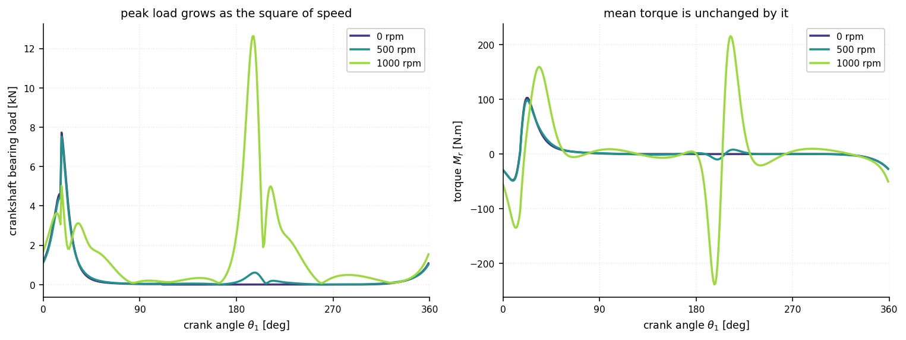
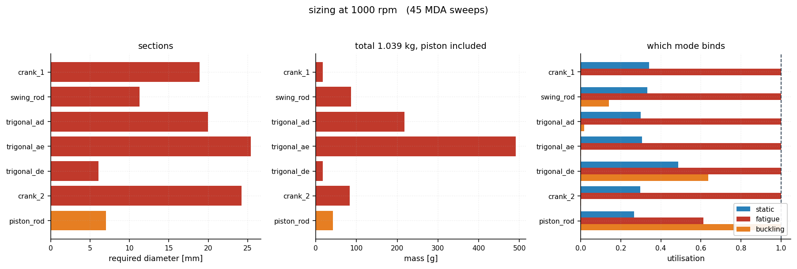

# EX-link Atkinson-cycle engine optimization

Multidisciplinary design of an **extended-expansion (Atkinson) linkage** for a Shell
Eco-marathon engine, optimised for the only thing the competition scores: **how far the car
gets on a given quantity of fuel**.

Eleven geometric design variables, one discrete gear module, a strongly coupled
structure/dynamics analysis solved as an MDA, and a chain that carries all of it through to
kilometres per litre — so that efficiency, envelope size, torque ripple and structural mass
are priced against each other by physics rather than by weights.

The physics is NumPy: closed-form kinematics, an idealised Atkinson cycle, a full d'Alembert
load analysis, static/fatigue/buckling sizing, Coulomb friction, a whole-engine mass budget
and a burn-and-coast vehicle model — with exact analytic derivatives through the parts where
finite differences are not merely inaccurate but wrong. The optimization is driven by
**[GEMSEO](https://gemseo.readthedocs.io)**, so the same problem can be handed to SLSQP,
differential evolution, an augmented Lagrangian or NSGA-II without rewriting anything. The
mechanism is animated with **matplotlib**.

Three findings, each with a test pinning it:

- **The quasi-static optimum is the worst place to be.** Maximising efficiency without
  inertia drives the linkage to its transmission-angle singularity, which is exactly where
  the accelerations, the bearing loads and hence the structure are worst. Backing off costs
  nothing and halves the engine.
- **`g ≤ 0.01 mm` cannot be manufactured.** The constraint is tighter than the tolerance of
  the parts that produce it — process capability 0.11, and no ISO grade fixes it.
- **The Atkinson linkage's advantage is firing frequency, not extended expansion.** Against a
  slider-crank sized by identical code it wins 24 %; remove the one-revolution cycle and the
  advantage falls to 2.8 %.

---

## The design problem

An extended-expansion engine expands the burnt gas further than it compressed the fresh
charge, recovering work that an Otto cycle throws away with the exhaust. Doing that
*mechanically* — rather than by holding the inlet valve open — needs a linkage whose piston
reaches top dead centre **twice per crankshaft revolution**, with two *different* bottom dead
centres: the short one sets the compression stroke, the long one the expansion stroke.

The linkage used here follows Honda's
[EXlink](https://global.honda/en/power/technology/exlink/) topology, with three changes: a
crank is inserted between the eccentric shaft and the swing rod, and another between the
crankshaft and the trigonal link, which frees up two more dimensions to optimize; and the
roles of the crankshaft and eccentric shaft are exchanged, so the whole four-stroke cycle
completes in **one** turn of the output shaft.

### Specification

The engine data are those of a Shell Eco-marathon prototype class single cylinder:

| quantity | symbol | value |
|---|---|---|
| bore | `Φ` | 32 mm |
| expansion stroke | `STE` | 74 mm (required) |
| compression ratio | `ε` | 16 (required) |
| clearance volume | `V₀` | 3 cm³ |
| plenum pressure | `P₀` | 1.2 bar |
| combustion pressure ratio | `k = P₃/P₂` | 1.7 |
| polytropic exponent | `γ` | 1.22 |
| piston length (pin to crown) | `p` | 16 mm |
| max piston-rod tilt | `mra` | 10° |
| gear ratio, crankshaft : eccentric | `r₁/r₂` | 2 |

`ε = 16` is high enough to knock on pump fuel; the target assumes variable valve phasing and
a suitable fuel, and is treated here purely as a geometric requirement. With `Φ = 32 mm` and
`V₀ = 3 cm³` it pins the compression stroke at `STC = 15 V₀/A_p ≈ 55.95 mm` against the
required `STE = 74 mm` — that asymmetry is what the linkage exists to produce.


*Left: the linkage. Right: piston height, the p–V cycle, and crankshaft torque, with a
marker tracking the crank angle on each. Regenerate with `exlink animate`.*


The piston reaches the **same** top dead centre twice (`g = 0.006 mm`) but two different
bottom dead centres — `STE = 74.00 mm` against `STC = 55.95 mm`. Torque is strongly positive
through expansion, negative through compression, and flat through intake and exhaust, where
the cylinder is at plenum pressure and the piston carries no gas load.

**Design variables** — `X = (a, c, I, x_b, y_b, x_1, e, q_1, q_2, θ_f, θ_r)ᵀ`

| | |
|---|---|
| `a` | swing rod `QA` |
| `c` | side `AD` of the trigonal link |
| `x_b`, `y_b` | position of `E` in the frame carried by `AD` |
| `e` | piston rod `EP` |
| `q_1`, `q_2` | cranks on the crankshaft and the eccentric shaft |
| `I` | distance between the two shafts |
| `x_1` | lateral offset of the cylinder axis |
| `θ_f`, `θ_r` | crank dephasing, and shaft-axis orientation |

**Formulation**

```
l_b ≤ X ≤ u_b
min  f(X)    = (−η,  H,  B)ᵀ                       efficiency, and the two envelope sizes
s.t. c(X)    = (mra−10, W−0.985, g−0.01, 10−d, γ−0.02)ᵀ ≤ 0
     c_eq(X) = (STE−74, ε−16)ᵀ = 0
```

Most of those constraints exist to make the problem **well posed** rather than to express a
specification, and they are the interesting part of the formulation:

- **`W ≤ 0.985`** — the two arccosine arguments of the closed-form inversion. If either
  reaches 1, the crankshaft cannot turn through a full revolution; it only rocks. Feeding
  `W` to the optimizer as a *number* rather than letting the analysis throw is what makes the
  global search converge.
- **`g ≤ 0.01 mm`** — the gap between the two top dead centres. Non-zero means burnt gas that
  cannot be scavenged.
- **four monotone phases** — a design whose piston goes up and down only once per revolution
  is a plain Otto engine, not an Atkinson one. Designs failing this are *penalised*
  (`η = 0`, `H = B = 1000`), never rejected.
- **`γ ≤ 0.02`** — piston side load, which drives friction.

---

## Install

Any of these works; pick whichever fits your setup.

```bash
# uv (fastest)
uv venv && uv pip install -e ".[dev,moea]"

# pip
python -m venv .venv && . .venv/bin/activate
pip install -e ".[dev,moea]"

# conda
conda env create -f environment.yml && conda activate exlink
pip install -e ".[dev]"

# tox — creates its own envs and runs the suite
tox

# make
make dev && make test
```

The `moea` extra pulls in [`gemseo-pymoo`](https://gitlab.com/gemseo/dev/gemseo-pymoo) for
NSGA-II. Everything except `exlink pareto` works without it.

---

## Use

```bash
exlink analyse                       # objectives and constraints of the reference design
exlink analyse --design published    # the historical baseline design (see Provenance)
exlink plot -o figures               # motion, p-V cycle, torque, mechanism
exlink animate -o figures/exlink.gif # animated mechanism + live cycle and torque
exlink refine --design published --save refined.json   # augmented Lagrangian
exlink optimize --save best.json     # differential evolution over the full box
exlink pareto --pop-size 200 --max-gen 60              # NSGA-II front
```

The commands chain through JSON design files:

```bash
exlink optimize --save best.json && exlink refine -d best.json --save final.json
exlink animate -d final.json -o final.gif
```

As a library:

```python
from exlink import analyse, PUBLISHED_DESIGN
from exlink.scenarios import refine, pareto_front, format_analysis

print(format_analysis(analyse(PUBLISHED_DESIGN)))

outcome = refine(PUBLISHED_DESIGN)          # augmented Lagrangian polish
print(outcome.feasible, outcome.analysis.metrics.efficiency)

front = pareto_front(pop_size=200, max_gen=60)   # NSGA-II
```

---

## Solution strategies

The formulation is exposed through GEMSEO, so several strategies apply to the same problem:

| strategy | entry point |
|---|---|
| external penalty `F(X) = −η + r⁻²(c_eqᵀc_eq + ⟨c⟩ᵀ⟨c⟩)` | `PenalisedExlinkDiscipline` |
| gradient-based local search | `SLSQP` (`maximise_efficiency`, `minimise_mass`) |
| derivative-free local search | `NELDER-MEAD`, `NLOPT_COBYLA` |
| global search | `DIFFERENTIAL_EVOLUTION` (`maximise_efficiency`) |
| multi-objective front | `pareto_front` / `local_pareto` (`PYMOO_NSGA2`) |
| moving limits on `H` and `B` | `sweep_moving_limits` |
| ε-constraint on efficiency | `sweep_efficiency_floor` |
| constraint-accurate polish | `Augmented_Lagrangian_order_0` (`refine`) |

Which of these actually work on this problem is not a matter of taste, and the rest of this
section reports what was measured.

### Why the multi-objective stage needs a relaxed problem

Population methods fare badly here, and sampling 2000 designs from a box around a good
solution shows why:

| constraint | satisfied by |
|---|---|
| `d ≥ 10` | 96 % of analysable designs |
| `W ≤ 0.985` | 76 % |
| `mra ≤ 10` | 28 % |
| `\|ε − 16\|` | 8 % |
| `γ ≤ 0.02` | 6 % |
| `\|STE − 74\|` | 4 % |
| **`g ≤ 0.01`** | **0.1 %** |

`g` is nominally an inequality, but at 0.01 mm it is a **third equality in disguise**. With
three equalities in eleven variables the feasible set is a thin sheet and the joint hit rate
for a random population is of order 1e-7 — so NSGA-II returns a "front" of one point, because
one point is all it ever found.

`exlink` therefore runs the multi-objective stage on a *relaxed* problem (`moea_targets`),
treating it as a scouting device that maps the shape of the trade-off, and finishes with
`refine`, which drives `g`, `STE` and `ε` back onto their true targets:

```python
front = pareto_front(pop_size=80, max_gen=30)   # 16 designs, η 0.247 – 0.282
final = refine(front.design)                    # feasible, η = 0.280
```

`sweep_moving_limits` walks the same trade-off on the *unrelaxed* problem instead — every
step a warm-started local solve, so `g`, `STE` and `ε` are met exactly at each point:

```
   H limit   eta [%]    H [mm]    B [mm]  feasible      <- examples/04_pareto.py
       236    28.113     236.0     151.7  True
       232    27.982     232.0     151.9  True
       228    27.209     228.0     152.2  False
       224    27.927     224.0     155.1  True
```


Every limit is met exactly, and efficiency falls as the envelope shrinks — shortening `H`
from 236 to 224 mm costs about 0.19 points of efficiency and pushes `B` out from 151.7 to
155.1 mm. It is a sequence
of independent local solves rather than one global sweep, so the curve is not perfectly
monotone and a step can land infeasible — the table reports which. It also needs a real
budget per step (~120 augmented Lagrangian outer iterations, ~3 minutes for the four): each
step must satisfy both equalities and all five inequalities while pushed against a limit it
did not previously meet, and a smaller budget returns "no feasible point" instead.

---

## Verification

The model is checked against physical invariants rather than against another
implementation, so the checks stand on their own.

**Rigid-body kinematics.** Every link keeps its length to 1e-9 mm over the revolution, and
the piston pin and crown stay on the cylinder axis to the same tolerance
(`tests/test_kinematics.py`).

**The quasi-static force chain** is pinned by the principle of virtual work: in a massless,
frictionless mechanism the instantaneous power in equals the power out, so
`M_r(θ₁) = −P dλ/dθ₁` at *every* crank angle. The chain reproduces that to machine precision
(`tests/test_loads.py`), which constrains the whole chain — piston, trigonal link, both
shafts and the gear pair — not just its endpoints. A second, independent route agrees: the
mean torque equals the indicated p–V loop area over 2π.

That check earns its keep. It caught a **sign error in the trigonal-link moment inversion**
while the model was being built — the version that disagreed with virtual work by a factor
of about −4. Expanding `DA ∧ F_A + DE ∧ F_E = 0` gives
`−c A sin(θ_a − θ_T) − C (DE ∧ û_e)_z = 0`, so the swing-rod load carries a leading minus
sign; see `exlink/loads.py`.

**Dynamics.** At zero speed the 18×18 simultaneous solve reproduces the sequential
quasi-static elimination exactly — torque, joint forces and gear load to 1e-11. Mean torque
is provably independent of engine speed (inertia does no net work over a closed cycle) and
holds to 1e-6 from 0 to 3000 rpm. With the gas load removed every reaction scales as exactly
`Ω²`.

**Derivatives.** Every analytic derivative is compared against a *converged* central
difference, and independently by GEMSEO's own `check_jacobian`. Details in
[Gradients](#gradients).

**The gear pair** transmits no net power: with `ω₂ = −2ω₁` and `r₁ = 2r₂` the two gear
torques cancel exactly, checked explicitly — a pair that generated power would silently
inflate the efficiency.

---

## Gradients

The feasible set here is a **sliver**. At the reference design the two equality
constraints leave a band 0.1 mm wide on `STE` and 0.1 wide on `ε`, inside an 11-dimensional
box with sides of tens of millimetres, while `W` and `γ` sit within 0.4 % and 7 % of their
bounds. A derivative-free method cannot work in that — COBYLA returns its starting point
unchanged after 313 s and 120 evaluations, whatever the budget.

The whole analysis chain is closed form, so its derivatives are too. `exlink.jacobian`
propagates them forward through the same chain the kinematics evaluates, and gets the
extremum-based metrics from the **envelope theorem**: for `max_θ f(X, θ)` attained at `θ*`,
the derivative is `∂f/∂X` evaluated there, because the term through the moving maximiser
carries `∂f/∂θ = 0`.

That matters more than "faster". These metrics are maxima over the crank angle, so the
sample attaining them *switches* as the design moves, and a difference quotient taken across
the switch is simply wrong — on `γ` at a 1e-4 mm step, 25 % wrong. GEMSEO's own
`check_jacobian` passes on all of them; `tests/test_jacobian.py` pins both the agreement and
that failure mode.

| | COBYLA | SLSQP + finite differences | SLSQP + exact gradients |
|---|---|---|---|
| moved from start | 0 mm | 32 mm | 38 mm |
| time | 313 s | 15 s | **4 s** |

Started from the historical baseline design, the gradient-based search reaches
**η = 30.77 %**, feasible at every resolution from 720 samples up:

| | η | `H` | `W` | `g` | feasible |
|---|---|---|---|---|---|
| historical baseline (`PUBLISHED_DESIGN`) | 35.62 % | 283.2 mm | 0.9892 | 8.52 mm | **no** |
| augmented Lagrangian (`REFINED_DESIGN`) | 27.87 % | 238.5 mm | 0.9811 | 0.0060 | yes |
| SLSQP + exact gradients (`GRADIENT_DESIGN`) | **30.77 %** | 319.8 mm | 0.9850 | 0.0095 | yes |

Read that comparison carefully. The baseline's 35.62 % is not a real result: that design
violates five constraints when re-analysed, most glaringly `g = 8.5 mm` against a 0.01 mm
bound, and efficiency is unbounded above once the constraints are dropped. And nothing limits
the envelope in this single-objective form, so the gradient result's extra three points over
the augmented Lagrangian are bought partly with size — the mechanism grows to `H = 320 mm`.
What the comparison does show is that a derivative-free polish stops well short of the
efficiency available at comparable feasibility.

### Through the MDA, too

`exlink.dynamics_jacobian` differentiates the coupling itself, so GEMSEO assembles the
coupled derivative from each discipline's *local* Jacobian rather than differencing the whole
fixed point. Three ideas carry it:

- **The spectral operator is linear.** Accelerations are `Ω²·D²r`, so `da/dp = Ω²·D²(dr/dp)`
  — the same operator applied to the kinematic derivative arrays. No new mathematics.
- **The 18×18 solve** gives `dx/dp = A⁻¹(db/dp − dA/dp·x)`, reusing the factorisation the
  forward solve already made. `A`'s entries are moment arms, so `dA/dp` follows from the
  position derivatives.
- **The sizing bisection is never differentiated.** The diameter is defined implicitly by
  `U(d, N, M) = 1`, so the implicit function theorem gives `dd/dN = −(∂U/∂N)/(∂U/∂d)`.

Verified piece by piece against converged central differences — mass properties and
accelerations to round-off, the equilibrium solve to 5e-7, the internal loads to 4e-7, and
the sizing by directional derivatives — plus GEMSEO's `check_jacobian` on the dynamics
discipline.

The same finite-step trap appears here and is pinned in `tests/test_dynamics_jacobian.py`:
perturb the loads by 1e-4 and the crank angle attaining the fatigue extremum hops across a
near-flat minimum, putting the difference quotient tens of percent out. The implicit function
theorem doesn't care.

**What this buys.** Minimising total moving mass at 1000 rpm, from the augmented-Lagrangian
design, subject to every constraint and a 25 % efficiency floor:

| | COBYLA | SLSQP, FD through the MDA | SLSQP, analytic |
|---|---|---|---|
| result | did not move | did not finish | **1.039 → 0.234 kg** |
| cost | 120 evals, 313 s | timed out at 560 s | **40 evals, 148 s** |

| | refined (quasi-static optimum) | coupled optimum |
|---|---|---|
| total moving mass | 1.039 kg | **0.234 kg** |
| peak bearing load | 12 629 N | 7 504 N |
| `H` | 238.5 mm | 205.7 mm |
| `W` | 0.9811 | 0.9372 |
| `η` | 28.20 % | 25.00 % |

Four times lighter, a third off the bearing load, a smaller envelope, for three points of
efficiency — and it got there by moving off the transmission-angle singularity, which is
where the mass was going. Ships as `reference.COUPLED_DESIGN`, feasible at every crank-angle
resolution from 360 to 2880 samples.

**Still differenced:** `η`, `H`, `B` and the clearance in the analysis discipline. All are
smooth, none is tight, and `η` would additionally need the crank angle of top dead centre
differentiated, because the combustion pressure jump puts moving-boundary terms in its
integral.

---

## Sizing the parts, and the coupling it creates

A quasi-static study cannot do this, and the reason is circular: the inertia loads need the
part masses, and the masses need the sections, which need the loads. Restoring inertia
therefore closes a loop:

```
    section diameters ──▶ member masses ──▶ inertia forces ──▶ internal loads
            ▲                                                        │
            └──────────── sizing against yield, ─────────────────────┘
                          fatigue and buckling
```

Neither half can go first. Under GEMSEO that is the **MDF** formulation:
`DynamicsDiscipline` and `StructureDiscipline` are strongly coupled — `diameters` one way,
the internal load histories the other — and an MDA converges them before the optimizer sees
a number.

```bash
exlink size --rpm 1000                    # size every part, inertia included
exlink size --rpm 3000 --plot fig.png     # ...and watch the loop run away
```

```python
from exlink import solve_for_design
sized = solve_for_design(PUBLISHED_DESIGN, speed_rpm=1000)
print(sized.total_mass_kg, sized.diameters, sized.feasible)

from exlink.scenarios import minimise_mass
best = minimise_mass(speed_rpm=1000, min_efficiency=0.25)
```

**Why sequential elimination stops working.** Without inertia every rod is a two-force
member — the forces at its two ends are equal, opposite and collinear with the rod — which is
what lets the loads be eliminated one body at a time, from the piston down to the crankshaft.
Give a rod mass and its end forces are neither collinear nor equal, so nothing can be solved
before its neighbours. Gruebler gives the mechanism one degree of freedom, so the load
problem is statically determinate — **18 unknowns against 6 bodies × 3 equations** — and
`exlink.dynamics` assembles and solves that 18×18 system at every crank angle. Its
determinant is the same quantity condition (4a) protects: at a critical configuration the
matrix goes singular and the forces blow up.

Each member is then sized against **static yield**, **Goodman fatigue** (Marin-corrected
endurance limit, evaluated per extreme fibre) and **Euler buckling**, by bisection — needed
because the fatigue size factor `k_b` itself depends on the diameter being solved for.

### Two results worth the trouble



**Efficiency does not care about speed; the parts care enormously.** At constant speed the
mechanism returns to its starting state each revolution, so inertia does no net work and the
*mean* torque is provably unchanged — verified to 1e-6 across 0–3000 rpm. Only the peaks
move, and with the gas load switched off every reaction scales as exactly `Ω²`. Since mass
goes as the cube of the acceleration level, it goes as the **sixth power of engine speed**:

| speed | moving mass | peak bearing load |
|---|---|---|
| 0 rpm | 0.25 kg | 7.7 kN |
| 1000 rpm | 1.03 kg | 12.5 kN |
| 1500 rpm | 8.43 kg | 245 kN |
| 2000 rpm | *loop runs away — no section is thick enough* | |



Fatigue binds on six of the seven members; the long slender piston rod goes to Euler
buckling instead.

**The quasi-static optimum turns out to be the wrong answer.** Maximising efficiency without
inertia drives the design to `W = 0.981`, a hair from the transmission-angle singularity,
because that is where the quasi-static lever arm is longest. But that same proximity is what amplifies accelerations — joint `A` sees 75× the
crank pin's. Backing off costs nothing and saves almost everything:

| swing rod | `W` | `η` | `H` [mm] | mass [kg] | peak bearing [N] |
|---|---|---|---|---|---|
| ×1.00 | 0.9811 | 28.20 % | 238.5 | 1.039 | 12 629 |
| ×0.94 | 0.9670 | 27.79 % | 227.8 | 0.610 | 6 541 |
| ×0.88 | 0.9560 | 27.92 % | 218.0 | 0.498 | 6 647 |
| ×0.82 | 0.9488 | 28.56 % | 213.2 | 0.450 | 6 027 |

Half the bearing load, *better* efficiency, a smaller envelope — and less than half the mass,
at 1000 rpm. At 1500 rpm the same comparison spans 8.43 kg against 2.03 kg. The near-singular
design was an artefact of leaving inertia out.

Both tables above are printed by `python examples/05_sizing_and_dynamics.py` (about 30 s).

The coupled problem therefore gains an objective a quasi-static formulation cannot express —
structural mass, since nothing in it determines a cross-section — and three constraints that
only exist once the loads are dynamic: `saturation_margin` (the loop ran away),
`slenderness_margin` (a "rod" thicker than a third of its length is not a beam), and
`bearing_margin`.

Full derivation, including the one idealisation used for the trigonal link and why the loop
converges at all, is in [docs/theory.md](docs/theory.md) §9.

---

## Range: the objective the problem was always about

Everything above stops at the engine. But the engine is for a Shell Eco-marathon car, and
that competition scores exactly one thing — **distance on a given quantity of fuel** — so the
three-objective formulation was never the real problem. It could only ever produce a Pareto
front, because nothing in it says what a millimetre of height is worth in points of
efficiency.

Range prices all of them, and the prices are not adjustable:

```
eta_mech  --.
             +--> brake efficiency --.
cycle work -'                         +--> fuel per metre --> RANGE
                                     /
H, B  --> crankcase --.             /
torque ripple --> flywheel --> engine mass --> rolling resistance
```

Two pieces had to be built before that chain would close.

**A real mechanical efficiency.** The package's `η` is *not* an efficiency: with no friction
in the model, the virtual-work identity makes the torque's work exactly equal the gas force's
work at every crank angle. It is a kinematic quality measure — how much *mean* torque a
piston motion converts into — and nothing is lost in it. `friction.py` supplies the losses
that are really there, from quantities the dynamic solve already produces: seven journals
under known reactions turning through known relative angles, the ring pack and skirt sliding
against the liner reaction the side-load constraint already bounds, and the gear mesh. This
is what makes the constraint set *mean* something: a design that leans on the liner now burns
its fuel on the liner.

**A mass budget worth optimising.** The coupled sizing loop returns the mass of the seven
sized members: about 0.15 kg. No engine weighs 0.15 kg, and optimising that number optimises
a tail while a twelve-kilogram dog goes unmodelled.

### The mass budget

Eight contributions, each sized from something the analysis already knows. At the coupled
reference design, 1000 rpm:

| item | mass | share | set by |
|---|---|---|---|
| flywheel | 9.54 kg | 78 % | the cyclic torque fluctuation the linkage produces |
| crankcase | 0.90 kg | 7 % | **the envelope `H × B`**, at a stiffness-driven wall |
| shafts | 0.65 kg | 5 % | combined bending and torsion at the journals |
| bearings | 0.48 kg | 4 % | journal diameter, via catalogue proportions |
| cylinder + head | 0.26 kg | 2 % | bore and peak pressure |
| gears | 0.15 kg | 1 % | peak tooth load, and the chosen module |
| linkage | 0.15 kg | 1 % | the sizing fixed point |
| piston | 0.04 kg | < 1 % | peak gas pressure |
| **total** | **12.17 kg** | | |

Two of these change the *shape* of the problem rather than its scale.

**The crankcase makes `H` and `B` physical.** A box has to enclose the mechanism and its walls
scale with the envelope. The two envelope objectives convert to kilograms at a rate the
physics fixes, and kilograms convert to range through rolling resistance. That is what
collapses three objectives into one.

**The flywheel makes torque smoothness physical.** A single-cylinder engine needs enough
rotating inertia to carry it through compression, and the requirement follows from the
*fluctuation* of the turning-moment diagram. A linkage with a flatter torque curve is
lighter — a design driver no geometric constraint expresses, pushing against a long lever arm.
It is also, at these speeds, three quarters of the engine.

Sizing it correctly took two corrections. Feeding the *total* torque into the flywheel
calculation double-counts energy the mechanism's own masses already store, overstating it
fivefold at low speed; it uses the gas turning-moment diagram instead. And carrying the main
bearing reaction through a plate spanning the whole crankcase asked for a 27 mm wall — the
load goes into a local boss, and the wall is set by castability and stiffness.

### How the car is driven

Not at constant speed. Every serious team drives **burn and coast**: run the engine hard from
`v_lo` to `v_hi`, declutch, coast back down, repeat. This is where the accelerations and
decelerations enter, and the naive expectation about them is wrong. Over one closed
burn-and-coast cycle the car starts and ends at the same speed, so the kinetic energy nets to
zero and

> `W_burn = ∫ F_res(v) dx` over the **whole** burn *and* coast distance.

Accelerating hard costs **nothing** in resistance work. What burn-and-coast buys is that the
engine spends its running time at high load; what it costs is aerodynamic, since drag goes as
`v²` and swinging around a mean burns more than cruising at it. Both are in the model, and
there is a test pinning the energy balance.

The minimum-average-speed rule is active at every optimum where the engine has power to
spare, which collapses the two-dimensional strategy search to one dimension: for each `v_lo`,
the rule pins `v_hi` exactly. That is not only faster — a grid search would make the objective
a step function of the design variables, and the gradient-based optimizer downstream would be
differentiating quantisation noise.

### Does the model land in the right place?

Nothing here is calibrated to a target, so the agreements are checks rather than fits:

| quantity | model | expected |
|---|---|---|
| indicated thermal efficiency | 47.7 % | 40–55 % for an idealised Atkinson cycle |
| p–V loop area vs torque integral | agree to 2 % | identical, by virtual work |
| IMEP | 2.7 bar | low, and correctly so for `k = 1.7` |
| FMEP | 1.2 bar | 0.5–1.5 bar for a small single |
| range | 2100–3400 km/L | 2000–3500 for Prototype-class gasoline |

### The discrete variable hiding in the inter-axle distance

The 2:1 gear pair appears in the geometric problem only as two primitive radii, both
continuous functions of `I`. That is a fiction. A gear has an integer number of teeth cut with
a standard-module hob, so

> `r = mz/2` and `z₁ = 2z₂` ⟹ **`I = 1.5 · m · z₂`**

`I` lives on a **lattice**, not an interval. Asking for `I = 56.55 mm` gets you 56.40 (m=0.8,
z=47) or 56.25 (m=1.25, z=30), and nothing between. Undercutting sets the floor at `z ≥ 17`,
so `I ≥ 25.5m`.

This matters because `I` is one of the variables the equalities `STE = 74` and `ε = 16` are
satisfied *with*. Snapping it to the lattice breaks both, and the remaining continuous
variables have to repair them — the classic *choose the integers, repair the continuum*
structure.

And the repair is not a formality. Moving `I` onto the nearest buildable lattice point — a
shift of **0.18 mm** — blows the top-dead-centre gap from 0.003 mm to 0.058 mm, five times its
bound, and knocks the expansion stroke 0.087 mm off target. The remaining ten variables then
have a real optimization problem to solve just to get back to feasibility.

Which constraint does the repair struggle with? `g`, every time. That is the same constraint
the [tolerance study](#does-it-survive-manufacturing) shows cannot be manufactured, and the
two results are the same fact reached independently: `∂g/∂I ≈ 0.27` mm per mm, so `g` responds
to *any* perturbation of the geometry — a machining tolerance, a gear lattice — far faster than
its 0.01 mm band allows. It is not a constraint that geometry can hold.

### Solving it as a mixed-integer problem

Enumerating a handful of lattice points and keeping the best is not a method: it has no
bound, no stopping criterion, and no way to know whether an unvisited point would have won.
`exlink/minlp.py` states the gear choice as the MINLP it is and hands it to the
[`gemseo-bilevel-outer-approximation`](https://pypi.org/project/gemseo-bilevel-outer-approximation/)
plugin, which implements the Duran–Grossmann decomposition:

```
main       gear_choice, a one-hot selection over the lattice   (categorical)
           solved by BILEVEL_MASTER_OUTER_APPROXIMATION
                |                                    ^
                | I, gear_module, gear_teeth         | linearisations and
                v      (catalogue interpolation)     | feasibility
sub        the ten remaining linkage variables       (continuous)
           MDF over the coupled disciplines, solved by SLSQP
```

GEMSEO's `Benders` formulation performs the split itself — categorical variables to the main
problem, everything continuous to a sub-scenario it wraps in an `MDOScenarioAdapterBenders` —
so the main problem optimises the sub-problem's *optimum*. A `CatalogueDesignSpace`
categorical variable drives three catalogue interpolations (`I`, the module and the tooth
count) so that picking a lattice point sets all three; at unit SIMP penalty the interpolation
is exactly `I = Σⱼ yⱼ Iⱼ`, linear and analytically differentiable, which is what the
outer-approximation master linearises.

Two changes were needed to make the package fit the formulation, and both are the formulation
being right rather than convenient:

- **The gear pair became `RangeDiscipline` *inputs*.** With the module fixed at construction
  time there is nothing for a master to choose.
- **The range margins are published in both sign conventions.** `positive=True` makes GEMSEO
  rename a constraint to `-runs_margin`, which is not an output of anything, and the scenario
  adapter addresses constraints by output name. So `runs_violation` and `gear_violation` are
  emitted alongside the margins, and the bi-level formulation attaches those.

**Infeasible sub-problems need no special machinery**, which is the reason OA fits here.
Pinning `I` throws the design off the equalities `I` was one of the variables used to satisfy,
so several lattice points have no feasible continuous solution at all. Attaching the
constraints with `main_level=True` puts an `is_feasible` condition on the main problem, and
such a point is excluded on evidence — carrying exactly the information enumeration discarded.

Outer approximation's finite convergence to the *global* optimum needs the sub-problem convex
in the continuous variables for each fixed choice, which this problem violates comprehensively.
So the master's bound is a bound under an assumption that does not hold, and `minlp.exhaustive`
solves every candidate separately so the decomposition's answer can be checked against the
true best over the lattice.

#### Convexification, and what it does here

Outer approximation's premature convergence on a nonconvex problem is exactly what the
plugin's convexification options exist for, and they are enabled by default: `posa` amplifies
the cut slopes so a linearisation is less likely to exclude a lattice point that is actually
better, and `adapt` corrects them by a secant method over the visited history so the cuts
behave like valid supports where the value function is not convex.

On this problem, measured over four candidates, they change nothing:

| setting | chosen | range | sub-solves |
|---|---|---|---|
| raw cuts (`posa=1`, `adapt=off`) | m=0.8, z=48 | 3366 km/L | 2 |
| `posa=2` only | m=0.8, z=48 | 3366 km/L | 2 |
| `adapt` only | m=0.8, z=48 | 3366 km/L | 2 |
| `posa=2` + `adapt` | m=0.8, z=48 | 3366 km/L | 2 |

The reason is structural rather than a failure of the options. The master terminates after two
sub-solves, and the adaptive secant correction needs more history than that before it can
adjust anything; and because the two equality constraints reach the master only through its
feasibility condition rather than as linearisations, there is little cut information for
`posa` to steepen. The options are left on because they are the right default — they can only
make the master more conservative — but on this problem they are a measured no-op, and saying
so is more useful than implying they fixed the shortfall.

#### Why the equalities stay equalities

The plugin's source notes that the master does not linearise equality constraints and
suggests relaxing them into inequality bands first. Doing that here exhausts memory: four
extra sub-problem constraints, each carrying a post-optimal sensitivity through an MDF
sub-problem whose coupling variables are the **45 367** load-history entries counted in
[How coupled is it, really?](#how-coupled-is-it-really). The process is OOM-killed past 15 GB.
With equalities the formulation adds a single `is_feasible` condition instead and the run
fits in **0.51 GB**.

That is the IDF result from earlier arriving in a second place: it is the *dimension* of the
coupling, not the cost of the MDA, that decides what a decomposition can afford. The cost of
the workaround is stated above — those two constraints inform the master only through
feasibility.

That check is worth reporting rather than skipping. Over four candidates at 1000 rpm, with a
25-iteration SLSQP budget per sub-problem:

| | chosen pair | range | sub-solves | seconds |
|---|---|---|---|---|
| outer approximation | m=0.8, z=48 | 3366 km/L | **2** | 575 |
| exhaustive | m=1.0, z=39 | 3385 km/L | 4 | 1056 |

The decomposition costs half the sub-solves and lands **0.6 % short** of the best point on the
lattice. That is exactly what nonconvexity buys you: the master stopped on a bound that is not
valid here, so it terminated before reaching the best candidate. The honest summary is that on
this problem the formulation's value is structural — a real mixed-integer statement, principled
handling of infeasible sub-problems, and a stopping criterion instead of a guessed budget —
rather than a better answer than enumeration. With a lattice too large to enumerate, that
structure is the only thing on offer.

### Reliability in the formulation, not a margin after it

`robustness.tolerance_report` measures what manufacturing does to a *finished* design — the
wrong end of the process, since it can only tell the optimizer it was wrong. But the obvious
repair is also wrong, and it is worth recording why, because an earlier version of this
package shipped it.

A fixed margin `g + k·σ_g ≤ 0` applied to each constraint separately is a reliability
statement **only if the constraints are independent**. They are emphatically not: all eight
are functions of the same eleven dimensions. Measured, the correlation reaches 0.94, and
exactly −1 for the two sides of a relaxed equality:

```
             rod   comp   gap   side  st_up st_lo  r_up  r_lo
  rod_angle   1.0  -0.28 -0.56 -0.38 -0.18  0.18 -0.15  0.15
  tdc_gap   -0.56   0.62   1.0 -0.05  0.72 -0.72  0.71 -0.71
  stroke_up -0.18   0.78  0.72  0.02   1.0  -1.0  0.94 -0.94
```

Demanding all eight hold at 3σ *simultaneously* is far stronger than demanding the system be
reliable at 3σ, and it pays for that strength by rejecting designs that are actually
acceptable. It also never computes a probability of anything.

What is computed now is the quantity actually wanted — the probability that **any**
requirement is missed:

> `P_f = 1 − Φₙ(β; ρ)`,  `βᵢ = −gᵢ/σᵢ`,  `ρᵢⱼ = ∇gᵢᵀΣ∇gⱼ / (σᵢσⱼ)`

a first-order (FORM) reliability index per constraint, combined through the multivariate
normal orthant with the correlation kept. Every gradient is the exact one, so it costs one
Jacobian evaluation and can be evaluated at every optimizer iteration;
`FailureProbabilityDiscipline` exposes it as a GEMSEO constraint, so the requirement becomes
a single `P_f ≤ target` rather than eight separate margins.

The correlation does not always help, which is the point of keeping it. Here the two largest
contributors are *anti*-correlated, so the system probability (0.645) comes out **above** the
independent estimate (0.563), not below.

**Validated against sampling, and honest about where it is weak.** At system level FORM agrees
well — 0.645 against 0.653 from 4000 Monte Carlo samples. Per constraint it does not: the
top-dead-centre gap is strongly nonlinear and FORM under-predicts it, 0.42 against 0.54. So
the sampling estimate is the reference and the first-order one is what is cheap enough to sit
inside an optimization. `gemseo-umdo` supplies both routes properly — a `Sampling` formulation
with the `Probability` statistic, and a gradient-based `TaylorPolynomial` — with the
manufacturing scatter declared through `uncertain_design_variables` as `x = nominal + u`.

#### What reliability says that the deterministic study could not

At the specified bounds, `COUPLED_DESIGN` has a **64.5 %** chance of missing at least one
requirement, essentially all of it the top-dead-centre gap. Inverting the reliability relation
answers *how much* the specification must give, with a number rather than "more": the gap
needs a bound of **0.054 mm** for a 10⁻³ target, against the 0.01 mm specified.

Relax it to that, and the problem moves rather than disappearing:

```
  constraint                g      sigma    beta     P(fail)
  tdc_gap            -0.04726    0.01531    3.09   1.010e-03    <- fixed
  stroke_lower       -0.01988    0.02910    0.68   2.473e-01    <- now binding
  system P(fail) 2.51e-01,  beta 0.67
```

The stroke band is *also* narrower than the scatter it is meant to represent, **and the design
sits off-centre inside it** — the residual is −0.030 of a ±0.05 band, so it spends most of its
margin on one side. Re-centring alone would take β from 0.68 to 1.7; reaching 10⁻³ needs a
band of ±0.09 mm.

Neither of those is something a deterministic optimum can see: it holds every constraint, at a
point from which half the builds fall out. That is what putting reliability in the formulation
buys, and it is a different answer from the fixed margin, not a rescaling of it.

Install it with `pip install exlink-opt[minlp]`; `exlink.minlp` is the only module that needs
the plugin and is deliberately not imported from the package root.

There is a second trap in the enumeration itself. Ranking candidate lattice points by
*distance* from the requested `I` is the obvious thing and the wrong thing: the nearest points
are reached with the **smallest** modules, and a small module needs a wide face to carry a
given tooth load. At the near-singular design — which puts 9 kN through the mesh, six times
what the backed-off one does — every point on the immediate lattice is unbuildable, and
reaching a workable pair means moving the centre distance by 13 %. `buildable_neighbours`
ranks by what can carry the load first and distance second.

That is one more way the singularity makes itself felt, and the geometric problem, where the
gears are two continuous radii, cannot see it at all.

Getting the module itself wrong is instructive, and it cost a debugging session worth
recording. Left free,
the module choice makes the objective a step function of `I`: the lightest workable module
changes at a threshold and the range jumps 40 km/L across it. A central difference straddling
that threshold returns a gradient of **3.7 × 10⁵** against a true gradient of order 10³. SLSQP,
handed a quadratic subproblem built from two constraint gradients that are both quantisation
noise, rejected it as *"inequality constraints incompatible"* and stopped at the starting
point having evaluated nothing. Pinning the pair — which also removes `I` from the design
space, leaving ten continuous variables — is both the fix and the correct algorithm.

### Manufacturability

`manufacturing.py` holds the R20 preferred bar diameters, the ISO 54 module series, and
minimum castable and machinable wall thicknesses. Rounding is applied *after* the fixed point
converges, never inside it: a step function inside a contraction turns it into a limit cycle
between two stock sizes. Rounding is always **up**, so it can never turn a certified section
unsafe, and `stock_premium` reports what buildability cost.

### What the optimization actually produced

SLSQP on `neg_range`, gear pair pinned, 1000 rpm, started from the coupled reference:

| | range | engine mass | `g` | strictly feasible |
|---|---|---|---|---|
| start (`COUPLED_DESIGN`) | 3338 km/L | 12.17 kg | 0.0067 mm | **yes** |
| best found (`RANGE_DESIGN`) | 3388 km/L | 12.47 kg | 0.0009 mm | no — see below |

The 1.5 % gain is modest, and the reason it is not simply banked is worth stating rather than
smoothing over.

`RANGE_DESIGN` satisfies every inequality, including the gap, at `g = 0.0009 mm`. It misses
the two *relaxed equalities* by 1.5 × 10⁻⁴ mm and 6.1 × 10⁻⁵ — SLSQP stopping within its own
convergence tolerance of the constraint it was handed. For scale, the tolerance study puts
the machining standard deviation of `STE` at 0.020 mm, **130 times larger**; no real part
would tell the two apart.

The obvious fix is to project it back onto the equality manifold, which
`project_onto_equalities` does exactly, by the minimum-norm Newton step from the analytic
Jacobians. That step is a few hundredths of a millimetre — and it moves `g` from 0.0009 to
0.0201 mm, twice its bound.

So the same wall appears from a fourth direction:

| perturbation | effect on `g` (bound: 0.01 mm) |
|---|---|
| IT8 machining tolerance on the members | `σ = 0.013 mm` |
| snapping `I` 0.18 mm onto the gear lattice | `0.003 → 0.058 mm` |
| minimum-norm equality projection | `0.0009 → 0.0201 mm` |
| tightest ISO grade that would hold it | 1.25i — off the ladder |

The honest reading is that **the specification is over-constrained**. The equality manifold
and the region `g ≤ 0.01` intersect in a sliver too thin for machining, gear selection or a
converged optimizer to land inside reliably. Treat `g` as an assembly adjustment — a shim on
the piston-rod length — or as a quantity to minimise, and `RANGE_DESIGN` is the answer at
3388 km/L. Under the specification as written, the best strictly feasible design is the one
we started from, and the 1.5 % is the price of a constraint that cannot be held.

That is not a result the optimizer could have delivered. It came out of the tolerance study,
and it is the single most useful thing in this repository for anyone who would actually build
the engine.

---

## Local optima, and why multistart is not straightforward here

Every gradient run in this repository is a single SLSQP solve from a single starting point.
On a problem this nonconvex that is a real gap, and closing it gives a mixed answer worth
recording.

**GEMSEO's `MultiStart` cannot be used, and not for want of budget.** It draws restarts from an
LHS over the design box. The feasible set here contains two *equality* constraints, `STE = 74`
and `ε = 16`, so it is a codimension-two manifold of measure zero and uniform sampling hits it
with probability zero. Measured:

| sampled from | analysable | feasible |
|---|---|---|
| global box | 5.8 % | **0 / 4000** |
| ±50 % around a feasible design | 33.5 % | **0 / 4000** |
| ±10 % around a feasible design | 75.8 % | **0 / 4000** |

Run anyway, `MultiStart` returns its starting point unchanged.

**What works is restarting on the manifold.** `scenarios.multistart` perturbs the incumbent,
projects the perturbation back onto the two equalities with `project_onto_equalities` — a
deterministic Newton step from the analytic Jacobians — and lets SLSQP restore the
inequalities from there. Even so only 1–2 restarts in 10 reach feasibility, which is itself a
measure of how thin the set is.

### It found that the efficiency optimum was local

`GRADIENT_DESIGN` came from one SLSQP run and reports **30.91 %**. Restarting finds **36.99 %** —
so it was a local optimum, by six points.

That is not a better engine, and the distinction matters. The better point is **443 mm** tall
against 320, and it sits exactly on the `g` bound: feasible at 720 crank samples, not at 1440.
The single-objective efficiency problem is unbounded in mechanism size — which is the stated
reason this package does not use it as the real objective — so a stronger search simply
exploits that harder. Multistart found a better answer to the wrong question.

### On the range problem the question is still open

Range is bounded, so it is the one where a better local optimum would matter. There,
**0 of 6 restarts reached feasibility** in 40 minutes at 25 SLSQP iterations each. So this
does not show `COUPLED_DESIGN` is globally optimal; it shows the experiment was inconclusive
at an affordable budget, and that is how it is reported. Establishing it would need either a
much larger budget per restart or a feasibility-restoration phase ahead of each one.

---

## Does it survive manufacturing?

The central finding is about *conditioning* — the mechanism sits near a singularity — and a
design chosen for nominal performance in a badly conditioned region is exactly what a
tolerance study exists to catch. Presenting a deterministic optimum without one would be
negligent.

Tolerances are ISO 286 IT grades, not invented numbers: `i = 0.45·D^(1/3) + 0.001·D` µm, with
IT8 at 25i for a machined member. Errors propagate two ways — **first order from the exact
Jacobians**, so a full assessment costs one extra Jacobian evaluation, and **Monte Carlo** to
check the linearisation, which is precisely what should be distrusted near a singularity.

```
  constraint               nominal   sigma_1st    sigma_MC     Cpk   violated
  expansion_stroke        -0.04992     0.03645     0.02011    0.83      11.0%
  compression_ratio       -0.04998    0.009347    0.005162    3.23       0.0%
  rod_angle                 -1.321    0.005555    0.005448   80.83       0.0%
  compatibility          -0.003854   4.029e-05    4.19e-05   30.66       0.0%
  tdc_gap                -0.004323     0.02173     0.01306    0.11      65.5%
  clearance                 -47.65     0.03584     0.03221  493.12       0.0%
  side_load              -0.001414   4.277e-05   4.098e-05   11.50       0.0%
```

**`g ≤ 0.01 mm` cannot be held.** The dimensions producing the top-dead-centre gap are held to
±0.011–0.031 mm at IT8, and combine to give `g` a standard deviation of 0.013 mm — larger than
the constraint band itself. Process capability is **0.11** against an industrial target of
1.33, and two thirds of nominally conforming builds violate it.

Scanning the IT ladder settles what to do about it. Holding `g` would need a tolerance unit
multiple of **1.25i**, below the tightest grade in the table. *No machining grade fixes it.*
This is a defect in the specification, not in any design that meets it, and the remedy is a
shim at assembly or a relaxed bound — not a better optimizer. Every other constraint is
comfortable.

First order overestimates σ by up to 80 % here, so it is **conservative**, not optimistic. Worth
stating: the opposite would make first-order robust design unusable in this region.

---

## How coupled is it, really?

"Strongly coupled" is an adjective. Gauss–Seidel converges linearly at a rate that *is* the
coupling strength, and the residual history already records it, so the claim can be a number:

```
      rpm       rho   sweeps   per decade   verdict
        0    0.0000        2          inf   weak
      250    0.0359        6          0.7   weak
      500    0.1307        9          1.1   moderate
      750    0.2558       12          1.7   moderate
     1000    0.6513       28          5.4   strong
     1250    0.6716       38          5.8   strong
     1500    0.6819       42          6.0   strong
```

At rest `ρ = 0` **exactly**: with no inertia there is no path from mass to load, so the
quasi-static problem is recovered and there is nothing to iterate. That is the sharpest check
that the measure reflects the physics rather than the solver. The gain grows with `ω²`, and by
1500 rpm each discipline rewrites two thirds of the other's input on every sweep.

So the answer to "does this problem need an MDA?" is *it depends on the operating point*, and
the dependence is steep.

### MDF or IDF?

`build_coupled_scenario` takes a `formulation_name`, so both can be run on the identical
problem. The comparison has a decisive answer, and it is structural rather than a matter of
timing:

| | objective | evaluations | seconds | feasible |
|---|---|---|---|---|
| MDF | 0.1444 kg | 25 | 41 | yes |
| IDF | — | 0 | — | **cannot be posed** |

IDF hands the coupling variables to the optimizer as design variables with consistency
constraints. Counting them settles it:

```
  design variables            11
  coupling variables       45368
    of which load histories  45360   (22680 each)
```

`member_axial` and `member_bending` are not scalars. They are the internal load history of
every member, at every crank angle, at every station along it — 7 × 360 × 9 apiece. IDF would
carry **45 367 variables and 45 367 equality constraints to optimise eleven real degrees of
freedom.**

So IDF is not slower here; it is unavailable. The general lesson separates cleanly from this
mechanism: IDF's cost scales with the *dimension* of the coupling, so a discipline pair that
exchanges distributed fields — load histories, pressure distributions, temperature fields —
rather than a handful of scalars will sit on the wrong side of that trade however expensive
its MDA.

---

## Is the linkage worth it?

The geometric formulation could not pose this question: it has no way to price a member. With
range as the objective it is a straight comparison against the mechanism the EX-link
replaces — a conventional slider-crank at the same bore, same clearance volume, same
compression ratio.

The comparison is only meaningful if both are treated identically, so the slider-crank goes
through the *same code* wherever the code is not topology-specific: `size_from_arrays` takes
its member list as a parameter precisely so the parity is real rather than asserted. Same
material, same yield/fatigue/buckling checks, same friction coefficients, same crankcase,
bearing, shaft and flywheel models, same vehicle. What differs is only what must — the
kinematics, the equilibrium system, and the cycle.

Independently validated: the Otto cycle reproduces `1 − ε^(1−γ)` to four decimals, and the
torque integral matches the p–V loop to 3 × 10⁻⁵.

| | slider-crank (Otto) | EX-link (Atkinson) |
|---|---|---|
| members / journals | 2 / 3 | 7 / 7 |
| indicated efficiency | 0.457 | 0.477 |
| mechanical efficiency | 0.740 | 0.853 |
| brake efficiency | 0.338 | 0.407 |
| engine mass | 19.3 kg @ 2000 rpm | 12.2 kg @ 1000 rpm |
| **range** | **2690 km/L** | **3338 km/L** |

The EX-link wins by 24 %. But decomposing it, only about a fifth of that is extended
expansion — indicated efficiency 0.477 against 0.457. Most of it is *mechanical* efficiency,
0.85 against 0.74, and the EX-link has **seven** journals to the slider-crank's three.

That inversion needed explaining rather than celebrating. The cause is firing frequency: in
this model the EX-link completes four strokes in one crankshaft revolution (see [The design
problem](#the-design-problem)), so per unit of work it accumulates half the journal rotation
and half the piston sliding of a four-stroke. That assumption was too load-bearing to leave
untested, so `firing_frequency_sensitivity` re-runs the comparison with it removed:

| | range | advantage |
|---|---|---|
| slider-crank | 2690 km/L | — |
| EX-link, as modelled | 3338 km/L | **+24.1 %** |
| EX-link, if it were a four-stroke | 2765 km/L | **+2.8 %** |

**The advantage is firing frequency, not extended expansion.** Reported the other way round it
would have been wrong.

### The generalisation

The second mechanism also settles whether the singularity finding is a quirk of one topology.
It is not, and the contrast is sharper than expected. Speed *reduces* the slider-crank's peak
main-bearing load:

| speed | peak main-bearing load | linkage mass |
|---|---|---|
| 0 rpm | 4735 N | 48.4 g |
| 2000 rpm | 4296 N | 45.1 g |
| 4000 rpm | 2985 N | 44.1 g |

That is correct, not a bug. The peak gas force lands near top dead centre, where the
reciprocating masses are decelerating and their inertia pulls the other way — the classic
**inertia relief** of the gas load, and the reason high-speed engines do not need
proportionally bigger main bearings.

The near-singular EX-link does the exact opposite: it has no feasible structure at all above
1000 rpm. Same physics, opposite sign, and **conditioning decides which**. Inertia relieves a
well-conditioned linkage and amplifies an ill-conditioned one. That is the central claim of
this study, now stated on two mechanisms instead of one.

---

## Layout

```
src/exlink/
  constants.py     engine spec, constraint targets, penalty values
  design.py        the 11-variable design vector and its box bounds
  kinematics.py    closed-form loop-closure inversion  →  λ(θ₁)
  cycle.py         four-phase detection + approximate Atkinson cycle
  loads.py         quasi-static force chain  →  crankshaft torque
  metrics.py       η, φ, H, B, mra, W, g, d, γ
  model.py         analyse(): the whole chain, penalising instead of raising
  disciplines.py   GEMSEO Discipline wrappers
  scenarios.py     design space, constraints, and the five workflows
  plots.py         motion / p-V / torque / mechanism / Pareto figures
  animation.py     animated mechanism, alone or with a live dashboard
  cli.py           the `exlink` command

  derivatives.py   exact spectral d/dtheta and d2/dtheta2 of periodic histories
  materials.py     material data, Marin factors, the Goodman line
  dynamics.py      inertia in the load path: the 18x18 equilibrium solve
  sizing.py        internal loads, then static / fatigue / buckling sizing
  coupled.py       the sizing <-> dynamics fixed point, and why it converges
  jacobian.py      exact d/dX of the analysis chain, by forward mode + envelope
  dynamics_jacobian.py   exact derivatives through the coupling itself

  friction.py      journal, ring and mesh losses -> real mechanical efficiency
  gears.py         the 2:1 pair, and the lattice the module imposes on I
  manufacturing.py preferred stock sizes, IT grades, minimum wall thicknesses
  mass_budget.py   the whole engine: crankcase from H x B, flywheel from ripple
  vehicle.py       burn-and-coast road load  ->  kilometres per litre
  performance.py   the full chain, from 11 dimensions to km/L
  robustness.py    ISO 286 tolerance, propagated first-order and by sampling
  formulations.py  coupling strength from the MDA residuals; MDF vs IDF
  slidercrank.py   the second mechanism, on identical terms
```

## Tests

```bash
pytest -m "not slow"    # fast: physics, grammars, figures
pytest                  # everything, optimizers included
tox                     # across Python 3.10 – 3.12
```

Every claim above is pinned by a test, including the ones that would be embarrassing to get
wrong: that inertia does no net work over a cycle, that burn-and-coast conserves energy, that
the Otto cycle reproduces its closed-form efficiency, that `ρ = 0` at rest, that stock
rounding never shrinks a member, and that the range advantage collapses when the firing
frequency assumption is removed.

## Provenance

The mechanism and the design brief come from an unpublished student study by the author
(Université de Technologie de Compiègne, 2015), which set up the kinematics, the idealised
cycle, the quasi-static load chain and the efficiency measure, and solved the quasi-static
problem in MATLAB. Everything needed to read, run and check this repository is restated here
and in [docs/theory.md](docs/theory.md); the document itself is not a citable reference and
nothing here depends on it.

Two designs carry over from that study as **historical baselines**, and they are labelled as
such wherever they appear:

- `PUBLISHED_DESIGN` — the design vector tabulated there. Re-analysed it violates five
  constraints (notably `g = 8.5 mm` against a 0.01 mm bound), so it is used as a *starting
  point*, not as a result. See `exlink/reference.py` for why it cannot be the design that
  produced the properties reported alongside it.
- `REFINED_DESIGN` — what an augmented Lagrangian makes of it here: feasible, `η = 27.87 %`.
  The quasi-static reference point the rest of the study is measured against.

Everything else — the dynamic load analysis, the sizing disciplines, the coupled MDA, the
analytic derivatives, and the `GRADIENT_DESIGN` and `COUPLED_DESIGN` results — is new work in
this repository.

Mechanism topology after Honda's
[EXlink](https://global.honda/en/power/technology/exlink/), modified as described in
[The design problem](#the-design-problem).

## License

MIT — see [LICENSE](LICENSE).
