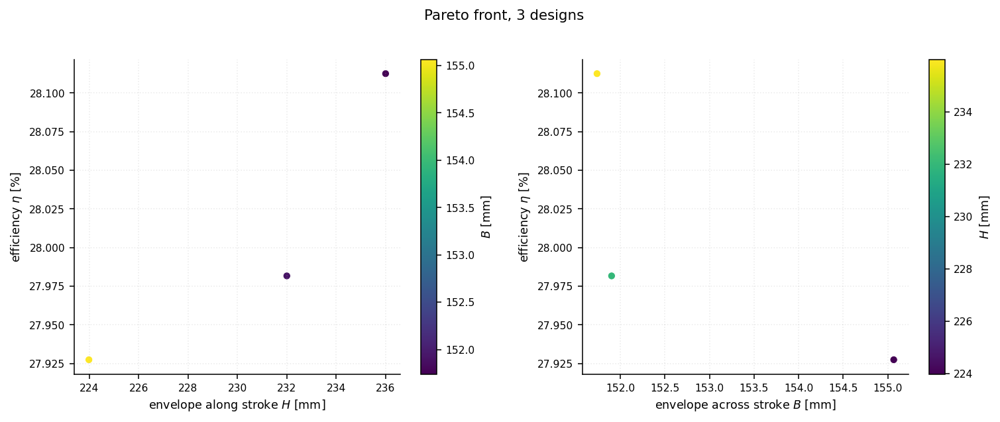

# The design problem

What the mechanism is, what it has to achieve, and why the resulting optimization problem is harder than its eleven variables suggest.

An extended-expansion engine expands the burnt gas further than it compressed the fresh
charge, recovering work that an Otto cycle throws away with the exhaust. Doing that
*mechanically* — rather than by holding the inlet valve open — needs a linkage whose piston
reaches top dead centre **twice per crankshaft revolution**, with two *different* bottom dead
centres: the short one sets the compression stroke, the long one the expansion stroke.

The linkage used here follows Honda's
[EXlink](https://global.honda/en/power/technology/exlink/) topology, with three changes: a
crank is inserted between the eccentric shaft and the swing rod, and another between the
crankshaft and the trigonal link, which frees up two more dimensions to optimize; and the
roles of the crankshaft and eccentric shaft are exchanged, so the whole four-stroke cycle
completes in **one** turn of the output shaft.

## Specification

The engine data are those of a Shell Eco-marathon prototype class single cylinder:

| quantity | symbol | value |
|---|---|---|
| bore | `Φ` | 32 mm |
| expansion stroke | `STE` | 74 mm (required) |
| compression ratio | `ε` | 16 (required) |
| clearance volume | `V₀` | 3 cm³ |
| plenum pressure | `P₀` | 1.2 bar |
| combustion pressure ratio | `k = P₃/P₂` | 1.7 |
| polytropic exponent | `γ` | 1.22 |
| piston length (pin to crown) | `p` | 16 mm |
| max piston-rod tilt | `mra` | 10° |
| gear ratio, crankshaft : eccentric | `r₁/r₂` | 2 |

`ε = 16` is high enough to knock on pump fuel; the target assumes variable valve phasing and
a suitable fuel, and is treated here purely as a geometric requirement. With `Φ = 32 mm` and
`V₀ = 3 cm³` it pins the compression stroke at `STC = 15 V₀/A_p ≈ 55.95 mm` against the
required `STE = 74 mm` — that asymmetry is what the linkage exists to produce.


*Left: the linkage. Right: piston height, the p–V cycle, and crankshaft torque, with a
marker tracking the crank angle on each. Regenerate with `exlink animate`.*


The piston reaches the **same** top dead centre twice (`g = 0.006 mm`) but two different
bottom dead centres — `STE = 74.00 mm` against `STC = 55.95 mm`. Torque is strongly positive
through expansion, negative through compression, and flat through intake and exhaust, where
the cylinder is at plenum pressure and the piston carries no gas load.

**Design variables** — `X = (a, c, I, x_b, y_b, x_1, e, q_1, q_2, θ_f, θ_r)ᵀ`

| | |
|---|---|
| `a` | swing rod `QA` |
| `c` | side `AD` of the trigonal link |
| `x_b`, `y_b` | position of `E` in the frame carried by `AD` |
| `e` | piston rod `EP` |
| `q_1`, `q_2` | cranks on the crankshaft and the eccentric shaft |
| `I` | distance between the two shafts |
| `x_1` | lateral offset of the cylinder axis |
| `θ_f`, `θ_r` | crank dephasing, and shaft-axis orientation |

**Formulation**

```
l_b ≤ X ≤ u_b
min  f(X)    = (−η,  H,  B)ᵀ                       efficiency, and the two envelope sizes
s.t. c(X)    = (mra−10, W−0.985, g−0.01, 10−d, γ−0.02)ᵀ ≤ 0
     c_eq(X) = (STE−74, ε−16)ᵀ = 0
```

Most of those constraints exist to make the problem **well posed** rather than to express a
specification, and they are the interesting part of the formulation:

- **`W ≤ 0.985`** — the two arccosine arguments of the closed-form inversion. If either
  reaches 1, the crankshaft cannot turn through a full revolution; it only rocks. Feeding
  `W` to the optimizer as a *number* rather than letting the analysis throw is what makes the
  global search converge.
- **`g ≤ 0.01 mm`** — the gap between the two top dead centres. Non-zero means burnt gas that
  cannot be scavenged.
- **four monotone phases** — a design whose piston goes up and down only once per revolution
  is a plain Otto engine, not an Atkinson one. Designs failing this are *penalised*
  (`η = 0`, `H = B = 1000`), never rejected.
- **`γ ≤ 0.02`** — piston side load, which drives friction.

---

## Why the feasible set is difficult

Population methods fare badly here, and sampling 2000 designs from a box around a good
solution shows why:

| constraint | satisfied by |
|---|---|
| `d ≥ 10` | 96 % of analysable designs |
| `W ≤ 0.985` | 76 % |
| `mra ≤ 10` | 28 % |
| `\|ε − 16\|` | 8 % |
| `γ ≤ 0.02` | 6 % |
| `\|STE − 74\|` | 4 % |
| **`g ≤ 0.01`** | **0.1 %** |

`g` is nominally an inequality, but at 0.01 mm it is a **third equality in disguise**. With
three equalities in eleven variables the feasible set is a thin sheet and the joint hit rate
for a random population is of order 1e-7 — so NSGA-II returns a "front" of one point, because
one point is all it ever found.

`exlink` therefore runs the multi-objective stage on a *relaxed* problem (`moea_targets`),
treating it as a scouting device that maps the shape of the trade-off, and finishes with
`refine`, which drives `g`, `STE` and `ε` back onto their true targets:

```python
front = pareto_front(pop_size=80, max_gen=30)   # 16 designs, η 0.247 – 0.282
final = refine(front.design)                    # feasible, η = 0.280
```

`sweep_moving_limits` walks the same trade-off on the *unrelaxed* problem instead — every
step a warm-started local solve, so `g`, `STE` and `ε` are met exactly at each point:

```
   H limit   eta [%]    H [mm]    B [mm]  feasible      <- examples/04_pareto.py
       236    28.113     236.0     151.7  True
       232    27.982     232.0     151.9  True
       228    27.209     228.0     152.2  False
       224    27.927     224.0     155.1  True
```



Every limit is met exactly, and efficiency falls as the envelope shrinks — shortening `H`
from 236 to 224 mm costs about 0.19 points of efficiency and pushes `B` out from 151.7 to
155.1 mm. It is a sequence
of independent local solves rather than one global sweep, so the curve is not perfectly
monotone and a step can land infeasible — the table reports which. It also needs a real
budget per step (~120 augmented Lagrangian outer iterations, ~3 minutes for the four): each
step must satisfy both equalities and all five inequalities while pushed against a limit it
did not previously meet, and a smaller budget returns "no feasible point" instead.

---

Next: [How the problem is posed for GEMSEO](formulation.md)
