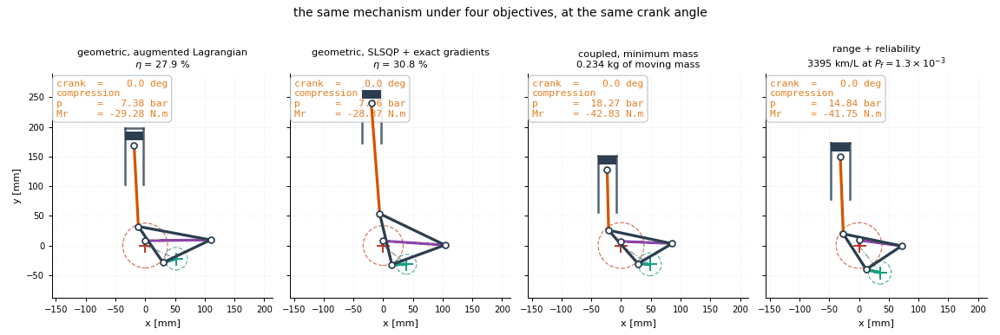

# 6. Results and discussion

Each result is stated, then supported, then discussed. Every number is computed
by the code of §4 and pinned by a test; none is transcribed. §7 collects the
limitations.



*What each objective converged to, from the same starting point, drawn at one
scale and one crank angle. Left to right: the geometric objective under an
augmented Lagrangian and under SLSQP with exact gradients, then minimum coupled
mass, then maximum range. The two geometric optima are long-limbed and stand
their cylinder high — §6.1 is about why — while the two that can see mass are
visibly shorter and squatter. Regenerate with `exlink animate --formulations`.*

## 6.1 The quasi-static optimum is the worst place to be

### Result

Maximising the lever-arm measure without inertia drives the design to
$W = 0.981$, a hair from the transmission-angle singularity, because that is
where the quasi-static lever arm is longest. Restoring inertia makes that the
worst available choice.

| swing rod | $W$ | $\eta$ | $H$ mm | moving mass | peak bearing |
|---|---|---|---|---|---|
| x1.00 | 0.9811 | 28.20 % | 238.5 | 1.039 kg | 12 629 N |
| x0.94 | 0.9670 | 27.79 % | 227.8 | 0.610 kg | 6 541 N |
| x0.88 | 0.9560 | 27.92 % | 218.0 | 0.498 kg | 6 647 N |
| x0.82 | 0.9488 | 28.56 % | 213.2 | 0.450 kg | 6 027 N |

Half the bearing load, a smaller envelope, less than half the mass — at equal or
better efficiency, at 1000 rpm.

### Why

The same proximity that lengthens the lever arm amplifies the accelerations:
joint $A$ sees 75 times the crank pin's. Since $m \sim (Ca)^3$ (§3.2), and every
inertia load scales as $\Omega^2$, structural mass grows as the **sixth power of
speed**:

| speed | moving mass | peak bearing load |
|---|---|---|
| 0 rpm | 0.25 kg | 7.7 kN |
| 1000 rpm | 1.03 kg | 12.5 kN |
| 1500 rpm | 8.43 kg | 245 kN |
| 2000 rpm | *no section is thick enough* | |

### Discussion

This is the clearest result in the study and the least fragile. It rests on the
equilibrium solve, which is verified against virtual work to machine precision
(§4.4), and the mechanism is understood rather than merely observed.

It also generalises. A well-conditioned slider-crank shows the *opposite* sign:
its peak main-bearing load **falls** with speed, 4735 N at rest to 2985 N at
4000 rpm, because the peak gas force lands near top dead centre where the
reciprocating inertia pulls the other way — classic inertia relief. Same physics,
opposite sign, and conditioning decides which.

## 6.2 A specified constraint cannot be manufactured

### Result

At IT8, the top-dead-centre gap bound of 0.01 mm has a process capability of
**0.11** against an industrial target of 1.33, and roughly two thirds of
nominally-conforming builds violate it.

The central finding is about *conditioning* — the mechanism sits near a singularity — and a
design chosen for nominal performance in a badly conditioned region is exactly what a
tolerance study exists to catch. Presenting a deterministic optimum without one would be
negligent.

Tolerances are ISO 286 IT grades, not invented numbers: `i = 0.45·D^(1/3) + 0.001·D` µm, with
IT8 at 25i for a machined member. Errors propagate two ways — **first order from the exact
Jacobians**, so a full assessment costs one extra Jacobian evaluation, and **Monte Carlo** to
check the linearisation, which is precisely what should be distrusted near a singularity.

```
  constraint               nominal   sigma_1st    sigma_MC     Cpk   violated
  expansion_stroke        -0.04992     0.03645     0.02011    0.83      11.0%
  compression_ratio       -0.04998    0.009347    0.005162    3.23       0.0%
  rod_angle                 -1.321    0.005555    0.005448   80.83       0.0%
  compatibility          -0.003854   4.029e-05    4.19e-05   30.66       0.0%
  tdc_gap                -0.004323     0.02173     0.01306    0.11      65.5%
  clearance                 -47.65     0.03584     0.03221  493.12       0.0%
  side_load              -0.001414   4.277e-05   4.098e-05   11.50       0.0%
```

**`g ≤ 0.01 mm` cannot be held.** The dimensions producing the top-dead-centre gap are held to
±0.011–0.031 mm at IT8, and combine to give `g` a standard deviation of 0.013 mm — larger than
the constraint band itself. Process capability is **0.11** against an industrial target of
1.33, and two thirds of nominally conforming builds violate it.

Scanning the IT ladder settles what to do about it. Holding `g` would need a tolerance unit
multiple of **1.25i**, below the tightest grade in the table. *No machining grade fixes it.*
This is a defect in the specification, not in any design that meets it, and the remedy is a
shim at assembly or a relaxed bound — not a better optimizer. Every other constraint is
comfortable.

First order overestimates σ by up to 80 % here, so it is **conservative**, not optimistic. Worth
stating: the opposite would make first-order robust design unusable in this region.

---

### Why

The dimensions producing $g$ are held to +/-0.011 to +/-0.031 mm and combine to
give it a standard deviation of 0.013 mm — larger than the constraint band
itself. Scanning the ISO ladder, holding it would need a tolerance unit multiple
of **1.25i**, below the tightest grade in the table. No machining grade fixes it.

Four independent routes agree:

| perturbation | effect on $g$ (bound 0.01 mm) |
|---|---|
| IT8 machining tolerance | $\sigma = 0.013$ mm |
| snapping $I$ 0.18 mm onto the gear lattice | $0.003 \to 0.058$ mm |
| minimum-norm equality projection | $0.0009 \to 0.0201$ mm |
| crank-angle resolution below 360 samples | 44 % error |

### The reliability statement

§3.8 computes a probability rather than a margin, over the seven constraints
whose uncertainty $\Sigma$ actually carries; it is evaluated *on* the solved
design rather than constrained during the search, so what follows is an audit
of that design and not a target it was held to (§3.10). For the coupled
reference design at IT8:

| | |
|---|---|
| system $P_f$, correlation kept | **0.645** |
| the same assuming independence | 0.563 |
| binding constraint | `tdc_gap` |
| bound needed for a $10^{-3}$ target | **0.054 mm** against 0.01 specified |

Keeping the correlation is not a formality and does not always reassure: the two
largest contributors are *anti*-correlated, so the system probability comes out
**above** the independent estimate.

Relaxing the gap to 0.054 mm moves the problem rather than removing it — the
stroke band becomes binding at $\beta = 0.68$, because that band is itself only
1.7 standard deviations wide and the design sits off-centre in it. Reaching
$10^{-3}$ needs $\pm 0.09$ mm.

### Most of this probability is avoidable, and free

The 0.645 is not the price of the requirements. It is the price of *ignoring
them while optimising*. Sampling 2500 designs about the reference and checking
the best by reliability against the full constraint set (§3.10) gives:

| | $\beta$ | $P_f$ | range |
|---|---|---|---|
| the reference design | $-0.373$ | 0.645 | 3338.3 km/L |
| best sampled, fully feasible | $+0.502$ | **0.308** | 3341.7 km/L |

The failure probability more than halves, every one of the twenty-five best
candidates is feasible, and the range does not fall — the best is 0.10 % higher
than the design it replaces. **The deterministic optimum is dominated on both
objectives at once.**

That is the standard argument for reliability-based design optimization,
measured on this problem rather than asserted: a deterministic optimizer
converges *onto* its active constraints, because nothing in the formulation
rewards standing off them, and a design sitting exactly on $g = 0$ fails half
the time. Backing off by a few hundredths of a millimetre is nearly free in
range and buys most of the reliability back.

Two things this does *not* say. It does not repair the specification — §6.2's
0.01 mm gap bound is still unattainable at any ISO grade, and $P_f = 0.308$ is
still far from a design target. And it is not a substitute for solving the
reliability-constrained problem: sampling found these points, whereas SLSQP
starting from the deterministic optimum could not move at all (§3.10).

### Discussion

The estimator is first-order and its weakest point is exactly where the finding
is strongest: $g$ is the most nonlinear constraint and FORM under-predicts its
failure probability, 0.42 against 0.54 sampled. That error is in the
conservative direction for the finding — the truth is worse than the estimate —
so the conclusion is not fragile even though the estimator is approximate.

This is a defect in the specification, not in any design meeting it, and it is
the single most useful result here for anyone who would build the engine.

## 6.3 Against an optimised conventional engine the advantage is firing frequency alone

### Result

Both mechanisms are held to the same compression ratio, the same clearance
volume and the same fuel per cycle, and both are sized by identical code. The
conventional engine is then *optimised over the variables it has* -- the rod
length, as the obliquity $r/l$, and the speed -- rather than given textbook
proportions, because comparing an optimised EX-link against a hand-set
slider-crank measures the optimization and not the topology.

| | slider-crank, hand-set | slider-crank, optimised | EX-link (Atkinson) |
|---|---|---|---|
| $r/l$, speed | 0.300, 2000 rpm | **0.195, 2151 rpm** | — , 1000 rpm |
| members / journals | 2 / 3 | 2 / 3 | 7 / 7 |
| indicated efficiency | 0.457 | 0.457 | 0.477 |
| mechanical efficiency | 0.740 | 0.787 | 0.853 |
| brake efficiency | 0.338 | 0.359 | 0.407 |
| engine mass | 19.3 kg | 16.9 kg | 12.2 kg |
| **range** | 2690 km/L | **2888 km/L** | **3338 km/L** |

Optimising the baseline is worth 7.4 % on its own, and all of it is mechanical:
the indicated efficiency is unchanged to four figures, because the compression
ratio and the charge are fixed and the thermodynamics cannot move. What moves
is the rod. A longer rod (obliquity 0.195 against 0.300) reduces the piston
side load, and with it the liner friction, which is the largest single loss in
the budget; the optimum is interior, because past about $r/l = 0.19$ the rod's
own mass and the taller engine start costing more than the friction it saves.

### The comparison, with and without the firing-frequency difference

In this model the EX-link completes all four strokes in one crankshaft
revolution -- that is what {py:func}`exlink.cycle.find_phases` requires of the
piston motion -- while a conventional four-stroke needs two. Per unit of work
the EX-link therefore accumulates half the journal rotation and half the piston
sliding. Removing that advantage means doubling its friction *and* halving its
power, since an engine that fires half as often makes half the power at the
same speed; both are done, and the result is re-scored through the vehicle
rather than compared as an efficiency, because halving the power changes the
operating point the burn-and-coast strategy can use.

| | vs hand-set baseline | vs optimised baseline |
|---|---|---|
| EX-link, as modelled (3338 km/L) | +24.1 % | **+15.6 %** |
| EX-link, as a four-stroke (2765 km/L) | +2.8 % | **−4.3 %** |

### Discussion

Against a hand-set baseline the reading was that extended expansion very nearly
fails to pay for itself. Against an optimised one it does not pay for itself:
**the sign changes**. An EX-link firing at conventional frequency is 4.3 %
*worse* than a conventional engine optimised under the same models, because the
two points of indicated efficiency that extended expansion buys do not cover
four extra journals, a gear train, and the mass of both.

So the +15.6 % that the mechanism does deliver is attributable to the
one-revolution cycle, not to extended expansion. That is a real advantage and
the reason to build the linkage — but it is a *cycle-rate* advantage, and it
would survive any other means of achieving the same firing frequency. It is
also the most fragile part of the result: it rests entirely on the phasing that
`find_phases` extracts from the piston motion, and an engine that did not
achieve it in practice would lose the whole margin and more.

Two things this comparison is not. It is not a claim about extended-expansion
engines in general: {cite:t}`watanabe2006` measure a 4-point indicated-efficiency
gain on hardware, and this model reproduces 2 points, so if anything the
thermodynamic side here is conservative. And it is not a statement that the
optimised baseline is a good engine — it is the best engine *these models* can
build with two degrees of freedom, and its 0.195 obliquity is longer-rodded
than practice, which suggests the model prices rod length only through mass and
not through the packaging that would really limit it.

What makes the comparison worth anything at all is that both sides went through
the same sizing, friction, mass-budget and vehicle code, and both were
optimised; only the kinematics, the equilibrium system and the cycle differ.

:::{note}
The optimised baseline is found by Nelder-Mead restarts on a two-variable box
({py:func}`exlink.slidercrank.optimise_slidercrank`). A derivative-free method
is used here having been rejected in §2.6 for the EX-link, and the difference
is the geometry of the feasible set, not a change of mind: the slider-crank's
feasible set is a full-dimensional box in which every sampled point can be
evaluated, while the EX-link's is a manifold of measure zero on which sampling
finds nothing. The compression ratio is deliberately *not* a design variable —
this model has no knock limit, so left free it would rise without bound and the
comparison would measure a missing sub-model.
:::

## 6.4 Imposing every constraint is worth 5 % of the objective

### Result

The problem of §3.10 checks the coupled and vehicle constraints on the design
the search returns; the second form in §3.10 *imposes* all fourteen
during the search, with the prescribed motion as a fallback objective. Run from
the same starting design, at the same speed, with the same pinned gear pair:

| | range | worst constraint | strictly feasible |
|---|---|---|---|
| start (`COUPLED_DESIGN`) | 3338 km/L | — | **yes** |
| §3.10, bound only at the end (`RANGE_DESIGN`) | 3388 km/L | — | no, by $1.5\times10^{-4}$ |
| **§3.10, imposed throughout** | **3501 km/L** | $+1.6\times10^{-4}$ | no, by $2\times10^{-4}$ |

**+4.9 % over the strictly feasible reference, and +3.4 % over the previous
best.** 836 evaluations, 78 minutes, the iteration cap reached rather than a
convergence test met — so the figure is a lower bound on what the formulation
reaches, not its optimum.

### Why

Imposing a constraint and checking it are not the same search. A constraint
that is only checked at the end lets the optimizer spend its whole trajectory
in a region it will later be told it cannot use; imposing it makes every step
legal, and the steps that remain are the ones that pay. The gain is not a
better algorithm — it is the same SLSQP — but a better-posed problem.

### The fallback earns its place only where it is needed

Two measurements say what the prescribed motion contributes, and they point in
opposite directions on purpose:

| start | evaluations that fell back | outcome |
|---|---|---|
| `COUPLED_DESIGN` (runs) | **0 of 836** | pure range maximisation |
| `REFINED_DESIGN` at 1250 rpm (does **not** run) | **26 of 103** | 0 km/L $\to$ 3336 km/L |

From a start that already runs, the ladder never fires and costs nothing. From
one where the engine will not run — friction exceeding indicated work, so km/L
simply does not exist — a quarter of the search is conducted on the target, and
the solve climbs out to a working engine. That is what a fallback should do,
and it is the case a constant penalty cannot handle: there is no gradient in a
constant.

The complementary measurement is the motion residual, which ends at **5.53 mm**
— far from the target. Once the range is computable everywhere the optimizer
abandons the prescribed motion entirely and pursues the objective. If the target
were pulling on the answer this number would be small; it is not, which is how
one tells a fallback from a constraint.

### Discussion

This design is **not reported as feasible**, for the same reason `RANGE_DESIGN`
is not: it ends $2\times10^{-4}$ outside the compression-ratio band. That is
SLSQP stopping within its own tolerance of a bound whose width is itself an
approximation, and §6.2 puts the machining scatter on $STE$ a hundred times
higher. No built engine would tell it from a design exactly on the band.

The study declines to call it feasible anyway, and the reason is worth stating
plainly: the alternative is deciding case by case which violations are small
enough to ignore, which is precisely the judgement §6.2 exists to take away from
the optimizer. A design 0.0002 outside a band is either inside the
specification or it is not, and the specification says not.

What this does not do is repair §6.2. The 0.01 mm gap bound remains unattainable
at any ISO grade, and imposing more constraints during the search does not
create feasibility where the specification admits none.

## 6.5 Supporting measurements

### How coupled the problem is

$\rho$ is the Gauss–Seidel contraction factor of §3.5.

| rpm | $\rho$ | sweeps | verdict |
|---|---|---|---|
| 0 | 0.0000 | 2 | weak |
| 500 | 0.1307 | 9 | moderate |
| 1000 | 0.6513 | 28 | strong |
| 1500 | 0.6819 | 42 | strong |

At rest $\rho = 0$ exactly, which is the sharpest available check that the
measure reflects the physics rather than the solver: with no inertia there is no
path from mass to load.

### What the derivatives buy

Minimising total moving mass at 1000 rpm, subject to every constraint and a
25 % efficiency floor:

| | COBYLA | SLSQP + differences | SLSQP + analytic |
|---|---|---|---|
| result | did not move | did not finish | 1.039 → 0.234 kg |
| cost | 120 evals | timed out | 40 evals, 148 s |

### The mixed-integer decomposition

Four gear candidates, 25 SLSQP iterations per sub-problem:

| | chosen pair | range | sub-solves | seconds |
|---|---|---|---|---|
| outer approximation | m=0.8, z=48 | 3366 km/L | **2** | 575 |
| exhaustive | m=1.0, z=39 | 3385 km/L | 4 | 1056 |

Half the sub-solves, 0.6 % short of the best lattice point. The convexification
options of §2.7 were enabled and measured to change nothing here: the master
terminates after two solves, which is less history than the adaptive correction
needs.

### Local optima

Manifold-projected restarts (§3.8) show the single-start efficiency optimum was
local: 30.91 % becomes 36.99 %. That better point is 443 mm tall against 320 and
sits on the $g$ bound — the single-objective efficiency problem is unbounded in
mechanism size, so a stronger search exploits that harder. On the range problem,
which is bounded, 0 of 6 restarts reached feasibility at an affordable budget.

### Reference designs

| design | $\eta$ | $H$ mm | $B$ mm | $W$ | $g$ mm | feasible |
|---|---|---|---|---|---|---|
| `PUBLISHED_DESIGN` | 35.62 % | 283 | 157 | 0.9892 | 8.5236 | no |
| `REFINED_DESIGN` | 27.80 % | 239 | 152 | 0.9811 | 0.0060 | yes |
| `GRADIENT_DESIGN` | 30.91 % | 320 | 159 | 0.9850 | 0.0095 | yes |
| `COUPLED_DESIGN` | 25.00 % | 198 | 131 | 0.9372 | 0.0070 | yes |
| `RANGE_DESIGN` | 25.46 % | 231 | 131 | 0.9319 | 0.0012 | no |

`COUPLED_DESIGN` is the design to compare against: it gives up five points of
$\eta$ to move off the singularity and gets a lighter, faster, longer-ranged
engine for it.

### The range optimization

SLSQP on `neg_range`, gear pair pinned, 1000 rpm, started from the coupled reference:

| | range | engine mass | `g` | strictly feasible |
|---|---|---|---|---|
| start (`COUPLED_DESIGN`) | 3338 km/L | 12.17 kg | 0.0067 mm | **yes** |
| best found (`RANGE_DESIGN`) | 3388 km/L | 12.47 kg | 0.0009 mm | no — see below |

The 1.5 % gain is modest, and the reason it is not simply banked is worth stating rather than
smoothing over.

`RANGE_DESIGN` satisfies every inequality, including the gap, at `g = 0.0009 mm`. It misses
the two *relaxed equalities* by 1.5 × 10⁻⁴ mm and 6.1 × 10⁻⁵ — SLSQP stopping within its own
convergence tolerance of the constraint it was handed. For scale, the tolerance study puts
the machining standard deviation of `STE` at 0.020 mm, **130 times larger**; no real part
would tell the two apart.

The obvious fix is to project it back onto the equality manifold, which
`project_onto_equalities` does exactly, by the minimum-norm Newton step from the analytic
Jacobians. That step is a few hundredths of a millimetre — and it moves `g` from 0.0009 to
0.0201 mm, twice its bound.

So the same wall appears from a fourth direction:

| perturbation | effect on `g` (bound: 0.01 mm) |
|---|---|
| IT8 machining tolerance on the members | `σ = 0.013 mm` |
| snapping `I` 0.18 mm onto the gear lattice | `0.003 → 0.058 mm` |
| minimum-norm equality projection | `0.0009 → 0.0201 mm` |
| tightest ISO grade that would hold it | 1.25i — off the ladder |

The honest reading is that **the specification is over-constrained**. The equality manifold
and the region `g ≤ 0.01` intersect in a sliver too thin for machining, gear selection or a
converged optimizer to land inside reliably. Treat `g` as an assembly adjustment — a shim on
the piston-rod length — or as a quantity to minimise, and `RANGE_DESIGN` is the answer at
3388 km/L. Under the specification as written, the best strictly feasible design is the one
we started from, and the 1.5 % is the price of a constraint that cannot be held.

That is not a result the optimizer could have delivered. It came out of the tolerance study,
and it is the single most useful thing in this repository for anyone who would actually build
the engine.

---

Next: [7. Conclusions](conclusions.md)
