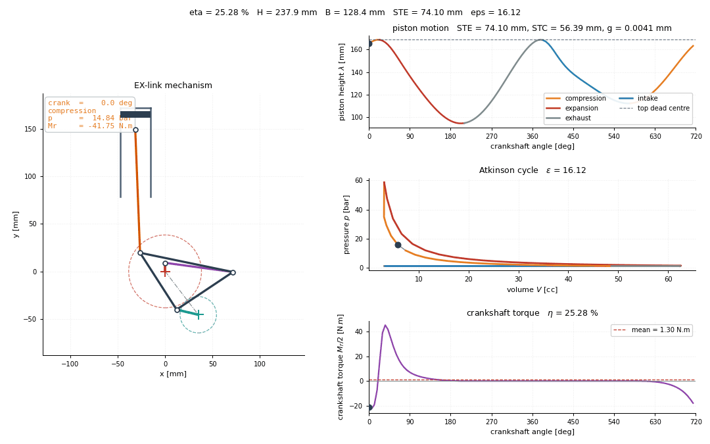
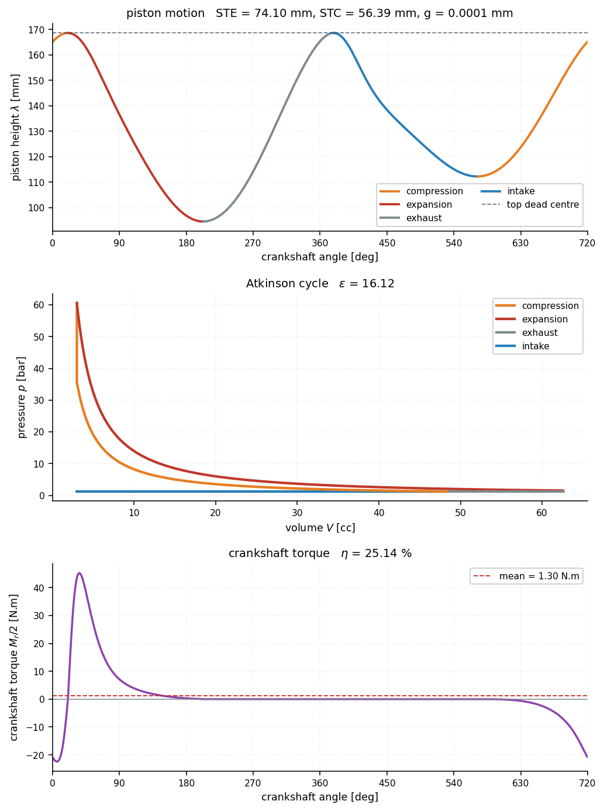

# 5. The use case

## 5.1 The mechanism

An extended-expansion engine expands the burnt gas through a larger volume ratio
than it compressed the fresh charge. Doing that mechanically requires a piston
that reaches top dead centre twice per crankshaft revolution with two different
bottom dead centres: the short one sets the compression stroke, the long one the
expansion stroke.

The linkage follows Honda's
[EXlink](https://global.honda/en/power/technology/exlink/) topology with three
changes. A crank is inserted between the eccentric shaft and the swing rod, and
another between the crankshaft and the trigonal link, freeing two further
dimensions to optimise; and the roles of the crankshaft and eccentric shaft are
exchanged, so the four strokes complete in **one** turn of the output shaft.

That last change is not incidental. It doubles the firing frequency for a given
displacement and speed, and §6.3 finds it to be the feature carrying the
mechanism's advantage over a conventional engine optimised under the same
models: the advantage survives matching the power strokes per minute, but
scoring the same linkage under a two-revolution gas exchange removes it. It is a
property of *this* topology rather than of extended expansion, and every result
below is conditional on it.

## 5.2 Specification

The engine data are those of a Shell Eco-marathon prototype class single cylinder:

| quantity | symbol | value |
|---|---|---|
| bore | `Φ` | 32 mm |
| expansion stroke | `STE` | 74 mm (required) |
| compression ratio | `ε` | 16 (required) |
| clearance volume | `V₀` | 3 cm³ |
| plenum pressure | `P₀` | 1.2 bar |
| combustion pressure ratio | `k = P₃/P₂` | 1.7 |
| polytropic exponent | `γ` | 1.22 |
| piston length (pin to crown) | `p` | 16 mm |
| max piston-rod tilt | `mra` | 10° |
| gear ratio, crankshaft : eccentric | `r₁/r₂` | 2 |

`ε = 16` is high enough to knock on pump fuel; the target assumes variable valve phasing and
a suitable fuel, and is treated here purely as a geometric requirement. With `Φ = 32 mm` and
`V₀ = 3 cm³` it pins the compression stroke at `STC = 15 V₀/A_p ≈ 55.95 mm` against the
required `STE = 74 mm` — that asymmetry is what the linkage exists to produce.



*Left: the linkage. Right: piston height, the p–V cycle, and crankshaft torque, with a
marker tracking the crank angle on each. Regenerate with `exlink animate`.*



The piston reaches the **same** top dead centre twice (`g = 0.006 mm`) but two different
bottom dead centres — `STE = 74.00 mm` against `STC = 55.95 mm`. Torque is strongly positive
through expansion, negative through compression, and flat through intake and exhaust, where
the cylinder is at plenum pressure and the piston carries no gas load.

**Design variables** — `X = (a, c, I, x_b, y_b, x_1, e, q_1, q_2, θ_f, θ_r)ᵀ`

| | |
|---|---|
| `a` | swing rod `QA` |
| `c` | side `AD` of the trigonal link |
| `x_b`, `y_b` | position of `E` in the frame carried by `AD` |
| `e` | piston rod `EP` |
| `q_1`, `q_2` | cranks on the crankshaft and the eccentric shaft |
| `I` | distance between the two shafts |
| `x_1` | lateral offset of the cylinder axis |
| `θ_f`, `θ_r` | crank dephasing, and shaft-axis orientation |

**Formulation**

```
l_b ≤ X ≤ u_b
min  f(X)    = (−η,  H,  B)ᵀ                       efficiency, and the two envelope sizes
s.t. c(X)    = (mra−10, W−0.985, g−0.01, 10−d, γ−0.02)ᵀ ≤ 0
     c_eq(X) = (STE−74, ε−16)ᵀ = 0
```

Most of those constraints exist to make the problem **well posed** rather than to express a
specification, and they are the interesting part of the formulation:

- **`W ≤ 0.985`** — the two arccosine arguments of the closed-form inversion. If either
  reaches 1, the crankshaft cannot turn through a full revolution; it only rocks. Feeding
  `W` to the optimizer as a *number* rather than letting the analysis throw is what makes the
  global search converge.
- **`g ≤ 0.01 mm`** — the gap between the two top dead centres. A non-zero gap means the two
  revolutions trap different volumes above the piston, so the engine realises two slightly
  different compression ratios. The bound is a modelling choice and not a physical limit;
  §6.2 prices it and adopts 0.1 mm.
- **four monotone phases** — a design whose piston goes up and down only once per revolution
  is a plain Otto engine, not an Atkinson one. Designs failing this are *penalised*
  (`η = 0`, `H = B = 1000`), never rejected.
- **`γ ≤ 0.02`** — piston side load, which drives friction.

---

## 5.3 Model set-up

The disciplines of §3 are evaluated at the following settings unless stated
otherwise. Each is a resolution or modelling choice rather than a design
variable.

| setting | value | why |
|---|---|---|
| crank angles per revolution | 360 (coupled), 720 (reporting) | the top-dead-centre gap needs 360+ to be measured correctly; §6.2 |
| stations along each member | 9 | internal loads are cubic in the station coordinate |
| material | 42CrMo4 Q&T | $S_y$ 700 MPa, $S_u$ 900 MPa |
| safety factors | 1.5 static, 2.0 fatigue, 2.5 buckling | first-iteration structural practice |
| journal friction coefficient | 0.008 | hydrodynamic, warm; swept in §6 |
| speed fluctuation for the flywheel | 0.10 | road vehicle with a clutch |
| machining tolerance | ISO 286 IT8 | machined linkage member |
| vehicle | 35 kg glider, 50 kg driver | Prototype class; the driver minimum is a competition rule |

The engine is 12.5 % of the 97 kg rolling mass, so a kilogram of engine is worth
13.6 km/L — the exchange rate §3.1 relies on.

## 5.4 Baseline

A design vector from an earlier unpublished study of the same mechanism is
carried as a starting point, not as a result. Re-analysed as printed it violates
five constraints, most tellingly a top-dead-centre gap of 8.5 mm against a
0.01 mm bound.

Rounding does not explain it: perturbing each variable by its
four-significant-figure half-width moves the stroke by less than 0.2 mm. The
explanation is conditioning — the vector sits at $W = 0.982$, where the piston
motion is violently sensitive to the link lengths, so the design is not
reproducible to four digits across two independent implementations. It is the
first appearance of the theme §6.1 develops.

---

Next: [6. Results and discussion](results.md)
