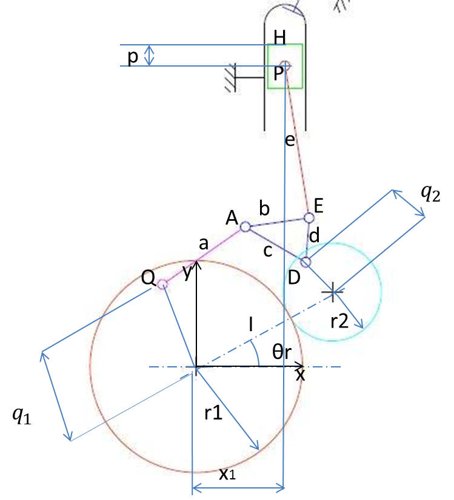
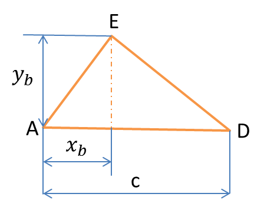
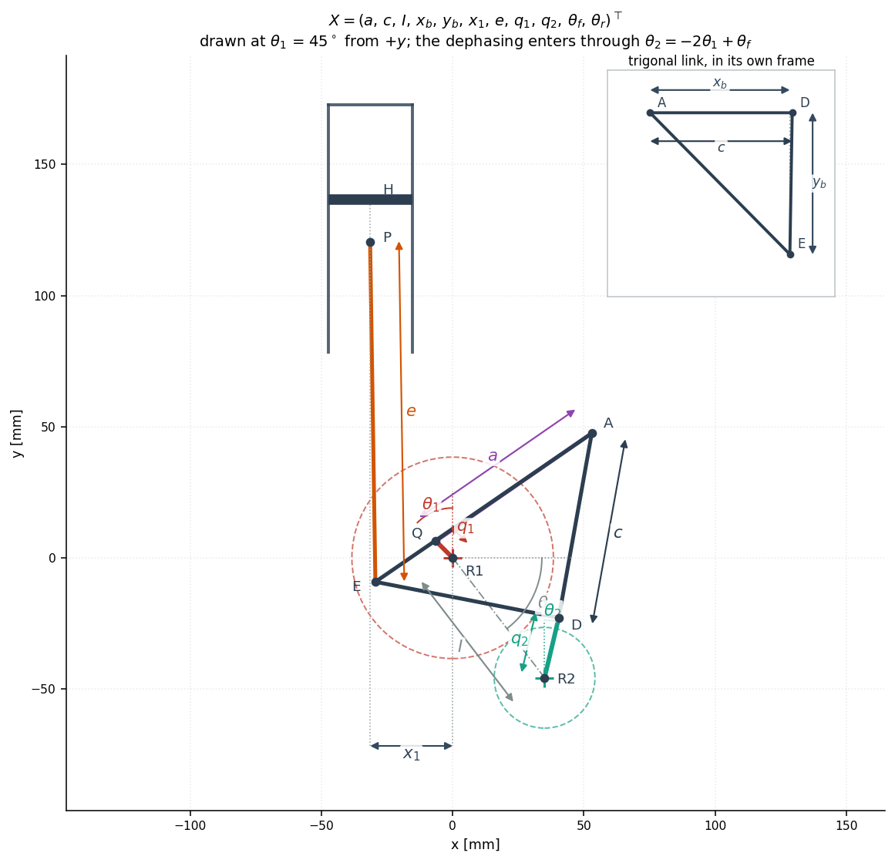

# 5. The use case

## 5.1 The mechanism

An extended-expansion engine expands the burnt gas through a larger volume ratio
than it compressed the fresh charge. Doing that mechanically requires a piston
that reaches top dead centre twice per cycle with two different
bottom dead centres: the short one sets the compression stroke, the long one the
expansion stroke.

The linkage follows Honda's
[EXlink](https://global.honda/en/power/technology/exlink/) topology with two
changes, both of which free a dimension to optimise: a crank is inserted between
the half-speed shaft and the swing rod, and another between the crankshaft and
the trigonal link.

The shaft arrangement is Honda's. The crankshaft carries the crank that drives
the trigonal link and turns **twice per cycle**, exactly as on a conventional
four-stroke; the half-speed shaft carries the swing-rod crank and turns once.
Power is taken from the crankshaft, so an engine speed quoted here means the
same thing it means for any other four-stroke, and the comparison of §6.3 is at
equal speed and equal firing rate with no correction of any kind.

## 5.2 Specification

The engine data are those of a Shell Eco-marathon prototype class single cylinder:

| quantity | symbol | value |
|---|---|---|
| bore | `Φ` | 32 mm |
| expansion stroke | `STE` | 74 mm (required) |
| compression ratio | `ε` | 16 (required) |
| clearance volume | `V₀` | 3 cm³ |
| plenum pressure | `P₀` | 1.2 bar |
| combustion pressure ratio | `k = P₃/P₂` | 1.7 |
| polytropic exponent | `γ` | 1.22 |
| piston length (pin to crown) | `p` | 16 mm |
| max piston-rod tilt | `mra` | 10° |
| gear ratio, half-speed shaft : crankshaft | `r₁/r₂` | 2 |

`ε = 16` is high enough to knock on pump fuel; the target assumes variable valve phasing and
a suitable fuel, and is treated here purely as a geometric requirement. With `Φ = 32 mm` and
`V₀ = 3 cm³` it pins the compression stroke at `STC = 15 V₀/A_p ≈ 55.95 mm` against the
required `STE = 74 mm` — that asymmetry is what the linkage exists to produce.


*`RELIABLE_DESIGN`, the design §6.4 arrives at, through one cycle — 360° of the
half-speed shaft, 720° of the crankshaft. Left: the linkage. Right: piston
height, the p–V cycle, and crankshaft torque, with a marker tracking the
crankshaft angle on each. Every abscissa runs over the 720° the cycle spans, so
these read against a conventional four-stroke's without conversion. Regenerate
with `exlink animate`.*


The piston reaches the **same** top dead centre twice per cycle — 360° of crankshaft apart,
`g = 0.00011 mm` between them on this design — but two different bottom dead centres,
`STE = 74.10 mm` against `STC = 56.39 mm` — the latter above the 55.95 mm an exact
`ε = 16` would need, because this design sits at `ε = 16.12`, inside the band §6.2 settles on. Torque is strongly positive
through expansion, negative through compression, and flat through intake and exhaust, where
the cylinder is at plenum pressure and the piston carries no gas load.

**Design variables** — `X = (a, c, I, x_b, y_b, x_1, e, q_1, q_2, θ_f, θ_r)ᵀ`



*The parametrisation, from the study this problem comes from (see Provenance).
`R1` carries the crank `q₁` ending at `Q` and the large gear of pitch radius
`r₁ = 2I/3`; `R2` carries `q₂` ending at `D` and the small gear `r₂ = I/3`, and
sits at distance `I` in the direction `θ_r` measured from `+x`. The swing rod
`a` runs `Q → A`, the trigonal link is the triangle `A–D–E` with sides `b`, `c`,
`d`, the piston rod `e` runs `E → P`, and the crown `H` sits `p = 16 mm` above
`P` on the cylinder axis, offset `x₁` from the `R1` axis. Ten of the eleven are
here; the eleventh, the dephasing `θ_f`, cannot be drawn on a single pose,
being the constant in `θ₂ = −2θ₁ + θ_f` — and `θ₁` and `θ₂`, the crank angles
that constant relates, are measured from `+y` rather than from `+x`
({doc}`theory` §1).*



*Two of the eleven replace `b` and `d`. Describing the triangle by its three
sides would force the design space to respect the triangle inequality and would
leave the sign of the apex undetermined; placing `E` at `(x_b, y_b)` in the
frame with origin `A` and first axis along `AD` lets both range freely over ℝ
and makes the design space a plain box ({doc}`theory` §1).*



*The same eleven on `RELIABLE_DESIGN`, the design §6.4 arrives at, frozen at
`θ₁ = 45°` — proportions to scale rather than schematic, which is why `q₁` is so
much shorter than the sketch above suggests. Regenerate with `exlink plot`.*

| | |
|---|---|
| `a` | swing rod `QA` |
| `c` | side `AD` of the trigonal link |
| `x_b`, `y_b` | position of `E` in the frame carried by `AD` |
| `e` | piston rod `EP` |
| `q_1`, `q_2` | cranks on the half-speed shaft and on the crankshaft |
| `I` | distance between the two shafts |
| `x_1` | lateral offset of the cylinder axis |
| `θ_f`, `θ_r` | crank dephasing, and shaft-axis orientation |

**Formulation**

```
l_b ≤ X ≤ u_b
min  f(X)    = (−η,  H,  B)ᵀ                       efficiency, and the two envelope sizes
s.t. c(X)    = (mra−10, W−0.985, g−0.01, 10−d, γ−0.02)ᵀ ≤ 0
     c_eq(X) = (STE−74, ε−16)ᵀ = 0
```

Most of those constraints exist to make the problem **well posed** rather than to express a
specification, and they are the interesting part of the formulation:

- **`W ≤ 0.985`** — the two arccosine arguments of the closed-form inversion. If either
  reaches 1, the shafts cannot turn through a full cycle; they only rock. Feeding
  `W` to the optimizer as a *number* rather than letting the analysis throw is what makes the
  global search converge.
- **`g ≤ 0.01 mm`** — the gap between the two top dead centres. A non-zero gap means the two
  revolutions trap different volumes above the piston, so the engine realises two slightly
  different compression ratios. The bound is a modelling choice and not a physical limit;
  §6.2 prices it and adopts 0.1 mm.
- **four monotone phases** — a design whose piston goes up and down only once per cycle
  is a plain Otto engine, not an Atkinson one. Designs failing this are *penalised*
  (`η = 0`, `H = B = 1000`), never rejected.
- **`γ ≤ 0.02`** — piston side load, which drives friction.

---

## 5.3 Model set-up

The disciplines of §3 are evaluated at the following settings unless stated
otherwise. Each is a resolution or modelling choice rather than a design
variable.

| setting | value | why |
|---|---|---|
| samples per cycle | 360 (coupled), 720 (reporting) | the top-dead-centre gap needs 360+ to be measured correctly; §6.2 |
| stations along each member | 9 | internal loads are cubic in the station coordinate |
| material | 42CrMo4 Q&T | $S_y$ 700 MPa, $S_u$ 900 MPa |
| safety factors | 1.5 static, 2.0 fatigue, 2.5 buckling | first-iteration structural practice |
| journal friction coefficient | 0.008 | hydrodynamic, warm; swept in §6 |
| speed fluctuation for the flywheel | 0.10 | road vehicle with a clutch |
| machining tolerance | ISO 286 IT8 | machined linkage member |
| vehicle | 35 kg glider, 50 kg driver | Prototype class; the driver minimum is a competition rule |
| engine speed | 2000 rev/min at the crankshaft | 1000 cycles per minute; §6.1 sweeps it |

Engine speeds are quoted at the crankshaft throughout, which turns twice per
cycle on both mechanisms. The `speed_rpm` the analysis functions take is the
*half-speed* shaft's, because that is the shaft the kinematics are parametrised
on, so `speed_rpm=1000` is the 2000 rev/min quoted here;
`Performance.output_speed_rpm` converts.

The engine is 12.5 % of the 97 kg rolling mass, so a kilogram of engine is worth
13.6 km/L — the exchange rate §3.1 relies on.

## 5.4 Baseline

A design vector from an earlier unpublished study of the same mechanism is
carried as a starting point, not as a result. Re-analysed as printed it violates
five constraints, most tellingly a top-dead-centre gap of 8.5 mm against a
0.01 mm bound.

Rounding does not explain it: perturbing each variable by its
four-significant-figure half-width moves the stroke by less than 0.2 mm. The
explanation is conditioning — the vector sits at $W = 0.982$, where the piston
motion is violently sensitive to the link lengths, so the design is not
reproducible to four digits across two independent implementations. It is the
first appearance of the theme §6.1 develops.

---

Next: [6. Results and discussion](results.md)
